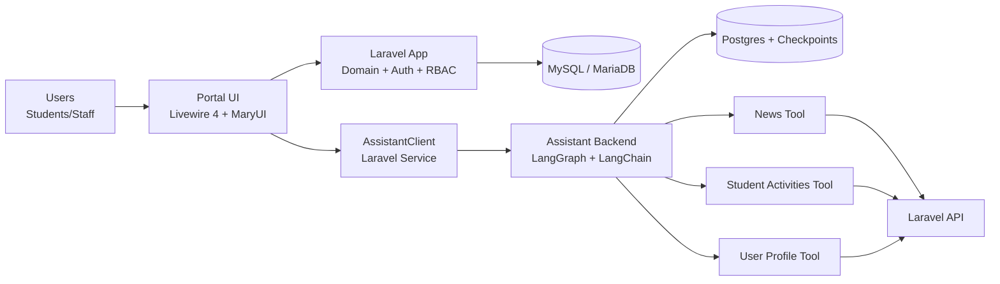

# System Architecture (ITE4116M Final Year Project)

## 1. Project Positioning
This project is the VTC MyPortal information system for students and staff, built as a dual-subsystem architecture:

- Main system (Laravel): Portal/Dashboard UI, domain data, APIs, authentication, authorization
- AI subsystem (OpenGPTs / LangGraph / LangChain): configurable Assistant runtime with tool-calling

The key value is not just using frameworks individually, but orchestrating multiple frameworks into a scalable, maintainable, and testable production-style system.

## 2. High-Level Architecture

## 3. Subsystems and Technical Responsibilities

### 3.1 Laravel Main System
- Framework: Laravel 13
- Interactive UI layer: Livewire 4 (page components / island / stream)
- UI components: MaryUI + Tailwind + daisyUI
- Security/auth flows: Fortify (registration, password reset, email verification, 2FA)
- Runtime/performance: Octane + FrankenPHP
- Domain layer: Eloquent + Enums + Middleware (Role/Permission)
- APIs: data endpoints consumed by AI tools

### 3.2 AI Assistant Subsystem
- Framework stack: OpenGPTs (LangGraph + LangChain + LangServe)
- Agent: configurable LLM, system message, and tool set
- Tools: custom MyPortal domain tools
- Persistence: Postgres (threads/checkpoints/history)
- Protocol: SSE streaming for token/message updates

## 4. Key End-to-End Flows

### 4.1 Regular Portal Flow
1. User interacts with Livewire pages (Portal / Dashboard)
2. Laravel processes domain logic, model queries, and permission checks
3. Livewire returns reactive UI updates

### 4.2 Assistant Q&A Flow
1. User submits a question in the Assistant page
2. Livewire calls AssistantClient
3. If this is a new conversation: create assistant + thread
4. Call runs/stream and consume SSE events
5. AI backend selects tools based on config (for example news_articles)
6. Tool calls Laravel APIs (/api/news, /api/activities, /api/profile)
7. Agent composes final answer from tool results
8. Response is streamed back to UI chat bubbles

## 5. Notable Framework Utilization

### 5.1 Livewire 4 as a Full-Stack Interaction Layer
- Instead of splitting frontend/backend stacks, page components unify UI + state management
- Assistant page uses island + stream to reduce custom JS state complexity

### 5.2 DTO and Type Mapping (Spatie Laravel Data)
- Assistant payloads/messages/threads are modeled with Data classes
- snake_case mapping, morphing, and wireable support reduce serialization coupling and errors

### 5.3 i18n + Data-Level Localization
- Astrotomic Translatable is applied across core domain models
- APIs load locale-specific translation relations server-side

### 5.4 Media and Content Safety
- Spatie Media Library manages avatar/cover assets with fallback behavior
- Purify casts sanitize rich HTML content to reduce XSS risk

### 5.5 Tool-Driven AI Integration (Beyond Basic Chat)
- AI is connected to controlled domain tools for news, activities, and profile data
- This establishes an auditable "LLM + internal API tools" integration pattern

### 5.6 Performance and Deployment Readiness
- Octane + FrankenPHP improves throughput for long-running worker architecture
- Main system and AI subsystem can be deployed independently for scale and fault isolation

## 6. Security and Governance
- Authentication: Laravel Fortify (including 2FA)
- Authorization: RoleMiddleware + PermissionMiddleware
- API input hardening: request validation + enum constraints
- Content protection: Purify HTML sanitization
- Tool governance: whitelist-based exposure of backend capabilities

## 7. Testing and Quality
- Laravel side: feature tests (API/Auth/Permissions)
- Assistant side: unit tests (news/user_profile/student_activities tools)

This demonstrates the system is not demo-only and supports regression confidence.

## 8. Why This Architecture Is a Strong FYP Theme
1. Demonstrates real engineering integration beyond basic CRUD
2. Extensible: easy to add new tools, APIs, and assistant behaviors
3. Maintainable: clear layering (UI / Domain API / Agent)
4. Verifiable: test coverage on both main and assistant subsystems

## 9. One-Sentence Defense Summary
"The key contribution of this project is framework orchestration: Laravel, Livewire, LangChain/LangGraph, and ecosystem packages are integrated into a practical information system with real-time interaction, data governance, AI tooling, testing, and deployment strategy."
