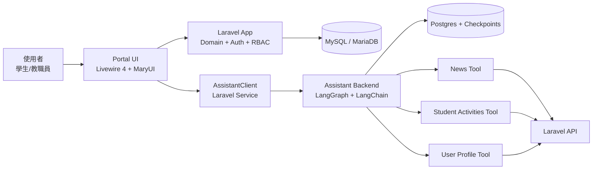

# 系統架構說明（ITE4116M Final Year Project）

## 1. 項目定位
本專案是 VTC MyPortal 學生及教職員資訊系統，採用雙子系統架構：

- 主系統（Laravel）：提供 Portal / Dashboard、業務資料、API、身份驗證與權限管理
- AI 子系統（OpenGPTs / LangGraph / LangChain）：提供可配置的 Assistant 與工具調用能力

此設計的核心重點不是「用了一個 framework」，而是把多個 framework 編排成一個可擴展、可維護、可測試的產品級系統。

## 2. 高層架構

## 3. 子系統與技術責任

### 3.1 Laravel 主系統
- 框架：Laravel 13
- UI 互動層：Livewire 4（page component / island / stream）
- UI 組件：MaryUI + Tailwind + daisyUI
- 驗證與安全：Fortify（註冊、重設密碼、Email 驗證、2FA）
- 長駐伺服器：Octane + FrankenPHP
- 業務模型：Eloquent + Enum + Middleware（Role/Permission）
- API：供 AI tools 讀取新聞、活動、用戶資料

### 3.2 AI Assistant 子系統
- 框架：OpenGPTs（LangGraph + LangChain + LangServe）
- Agent：可配置 LLM、system message、tools
- Tools：自定義 MyPortal 專用 tools
- 儲存：Postgres（thread / checkpoint / history）
- 協議：SSE 串流 token / message 回傳

## 4. 關鍵流程（端到端）

### 4.1 Portal 一般功能
1. 使用者經 Livewire 頁面互動（Portal / Dashboard）
2. Laravel 處理業務邏輯、模型查詢、權限檢查
3. 回傳 UI 更新（Livewire reactive rendering）

### 4.2 Assistant 問答流程
1. 使用者在 Assistant 頁面輸入問題
2. Livewire 呼叫 AssistantClient
3. 若為新對話：建立 assistant + thread
4. 呼叫 runs/stream，接收 SSE 串流
5. AI backend 根據設定選擇工具（例如 news_articles）
6. tool 呼叫 Laravel API（/api/news, /api/activities, /api/profile）
7. tool 結果回到 agent，組裝回答
8. 回答以串流方式顯示於前端 chat bubbles

## 5. 「善用 framework」的突出實踐

### 5.1 Livewire 4 作為全端互動層
- 非傳統前後端切開模式，而是以 Livewire page component 統一 UI 與狀態管理
- 在 Assistant 頁面實作 island + stream，減少手寫前端框架狀態管理複雜度

### 5.2 DTO 與型別映射（Spatie Laravel Data）
- Assistant payload / message / thread 皆以 Data class 建模
- 使用 snake_case mapper、morph、wireable 能力，降低序列化錯誤與耦合

### 5.3 i18n 與資料層多語
- Astrotomic Translatable 套用在多個核心 domain model
- API 依 locale 載入 translation relation，避免把多語處理塞進前端

### 5.4 媒體與內容安全
- Spatie Media Library 管理 avatar / cover 與 fallback
- Purify cast 過濾富文本內容，降低 XSS 風險

### 5.5 AI 工具化整合（不是單純聊天）
- AI 透過受控 tools 讀取校園新聞、活動、個人資料
- 形成「LLM + 企業內部資料 API」可審計的 integration pattern

### 5.6 效能與部署考量
- 使用 Octane + FrankenPHP 提升高併發下吞吐
- 主系統與 AI 子系統分離部署，利於擴展與故障隔離

## 6. 安全與治理
- 認證：Laravel Fortify（含 2FA）
- 授權：RoleMiddleware + PermissionMiddleware
- API 輸入：Request validation + Enum 規則限制
- 內容：Purify 過濾 HTML
- Assistant tool 設計：以白名單方式暴露資料能力

## 7. 測試與品質
- Laravel 端：Feature tests（API、Auth、Permission）
- Assistant 端：unit tests（news/user_profile/student_activities tools）

這代表系統不只可 demo，亦具備回歸驗證能力。

## 8. 為何這套架構適合 FYP 主軸
1. 反映真實工程能力：跨框架整合，而非單一 CRUD
2. 具可擴展性：可加新 tools、新 API、新 assistant 行為
3. 具可維護性：分層明確（UI / Domain API / Agent）
4. 具可驗證性：雙端測試覆蓋核心功能

## 9. 可直接用於答辯的總結句
「本專案的價值不在於單一 framework，而在於把 Laravel、Livewire、LangChain/LangGraph、以及相關生態套件整合為一個可落地的資訊系統：有即時互動、有資料治理、有 AI 工具化能力、亦有測試與部署策略。」
