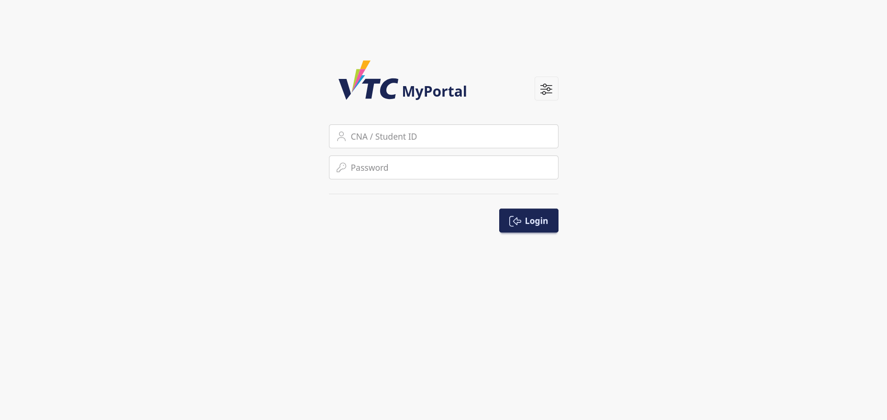
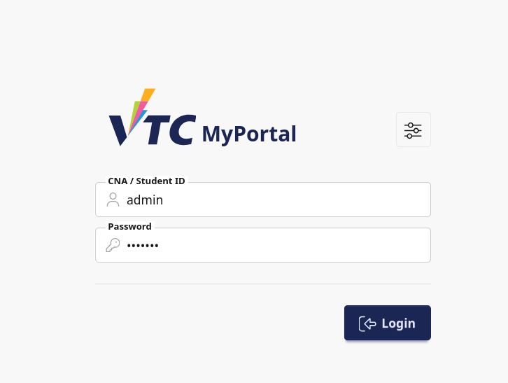
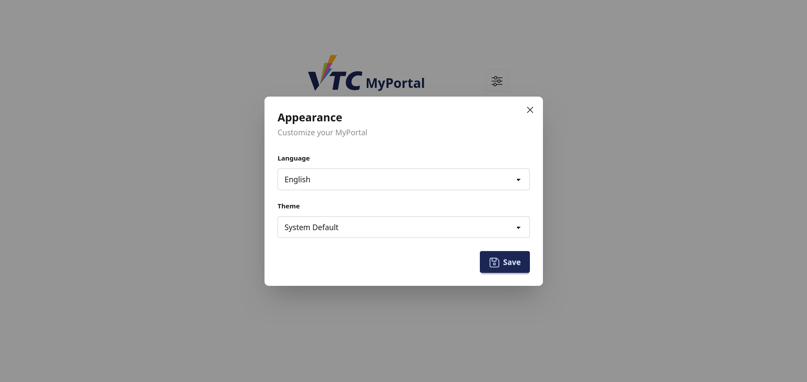

# 1. Login

## 1.1 Purpose
This section explains how staff and admin users sign in to VTC MyPortal to access operational and administrative functions.

## 1.2 Who Should Read This
This guide is for:
- Teaching staff
- Administrative staff
- System or module administrators

## 1.3 Before You Start
Prepare the following before login:
- A valid staff/admin username
- The correct account password
- Internet access and a supported browser

Recommended browsers:
- Chrome
- Edge
- Firefox
- Safari

## 1.4 Access the Login Page
1. Open a supported browser.
2. Enter the official MyPortal URL for staff/admin access.
3. Confirm the login interface contains:
   - Username input
   - Password input
   - Login button
   - Appearance button

> Image placeholder: Insert screenshot of staff/admin login page.

## 1.5 Login Procedure
1. Enter your staff/admin username in **Username**.
2. Enter your password in **Password**.
3. Click **Login** to continue.
4. On success, you are redirected to the dashboard or requested module page.

> Image placeholder: Insert screenshot with completed login form.

## 1.6 Appearance Settings (Optional)
You may adjust appearance settings through the slider icon before logging in.

1. Click the appearance icon.
2. Choose preferred display options.
3. Proceed with login.

> Image placeholder: Insert screenshot showing appearance options.

## 1.7 What Happens After Successful Login
After successful authentication:
- Your session is regenerated for security.
- You are redirected to:
  - The protected page you requested earlier, or
  - The default home/dashboard page

## 1.8 Failed Login Behavior
If authentication fails, the system shows the same validation message for username and password:
- Incorrect username or password

Perform these checks:
1. Confirm correct username format
2. Re-enter password carefully
3. Check keyboard language and Caps Lock
4. Ensure no trailing/leading spaces

> Image placeholder: Insert screenshot of login error message.

## 1.9 Troubleshooting for Staff/Admin
### Case A: Account Lockout or Access Restriction
- Contact the responsible administrator or IT support to verify account status.
- Confirm your account role permissions are active.

### Case B: Repeated Authentication Failure
- Reset password using the approved institutional process.
- Retry after password reset.

### Case C: Browser or Session Issues
- Clear browser cache and cookies.
- Try private/incognito mode.
- Retry using another supported browser.

## 1.10 Security and Compliance Notes
- Keep credentials confidential.
- Do not reuse passwords across services.
- Sign out when leaving your workstation.
- Report suspicious access attempts immediately.

## 1.11 Escalation and Support Details
When contacting support, provide:
- Staff ID / username
- Date and time of failed login attempts
- Error screenshot
- Browser and OS details
- Affected module/page (if applicable)
