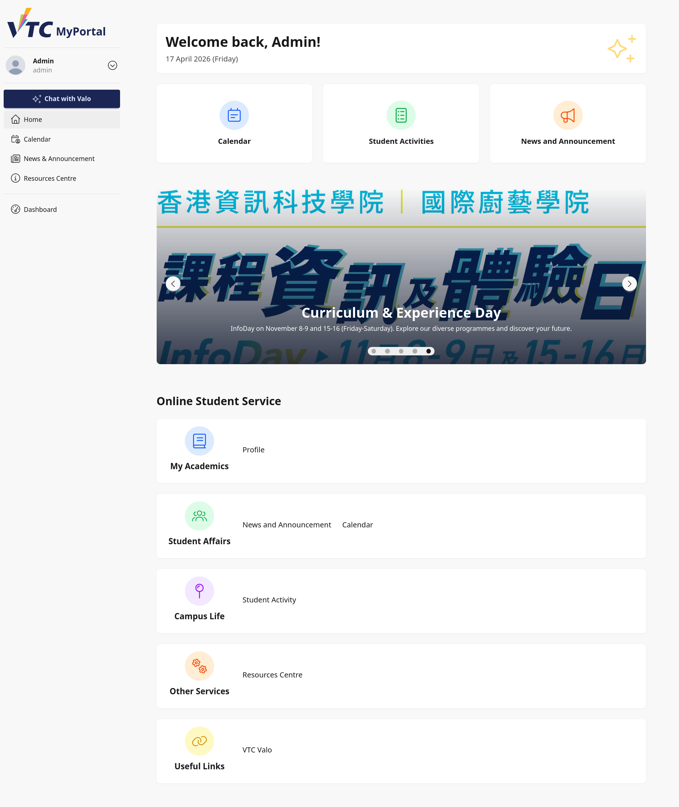
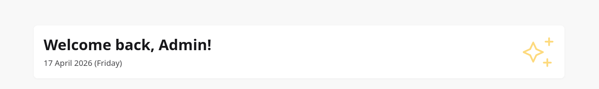
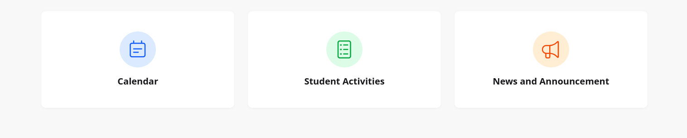
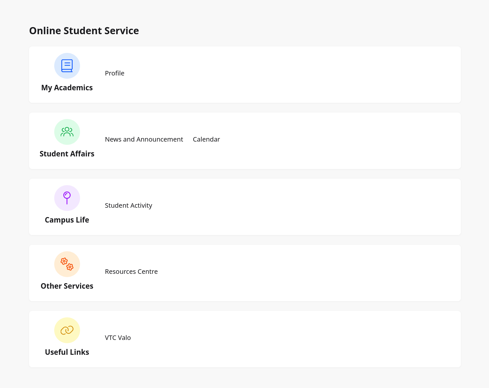

# 2. Home Page

## 2.1 Purpose
This section explains how staff and admin users use the Home page as the main portal landing page after login.

The Home page supports daily operational navigation by providing quick links, rotating announcements, and grouped service access.

## 2.2 Intended Audience
This guide is for:
- Teaching staff
- Administrative staff
- System and module administrators

## 2.3 Home Page Structure
The Home page includes four functional regions:
1. Welcome card
2. Quick access cards
3. Carousel panel
4. Online Student Service categories

> Image placeholder: Full Home page with section markers.

## 2.4 Welcome Card
The top card displays:
- Personalized greeting using logged-in user given name
- Current system date and day

Operational check:
- Confirm the displayed name matches the current signed-in account.

> Image placeholder: Welcome card detail.

## 2.5 Quick Access Navigation
Three cards provide direct entry points:

### 2.5.1 Calendar
Opens calendar functions for schedule and event visibility.

### 2.5.2 Student Activities
Navigates to activity listing and related management visibility.

### 2.5.3 News and Announcement
Opens announcements listing for institutional updates.

> Image placeholder: Quick access section.

## 2.6 Carousel Panel
The carousel presents highlighted content configured by active slides.

Slide elements may include:
- Image
- Title
- Description
- Optional external or internal link

Usage notes:
1. Slides auto-rotate in sequence.
2. Review key highlights from announcements or campaigns.
3. Open linked destinations when relevant.

> Image placeholder: Carousel in active state.

## 2.7 Online Student Service Categories
The lower section groups links for structured navigation.

### 2.7.1 My Academics
- **Profile**: Access personal particulars page.

### 2.7.2 Student Affairs
- **News and Announcement**
- **Calendar**

### 2.7.3 Campus Life
- **Student Activity**

### 2.7.4 Other Services
- **Resources Centre**

### 2.7.5 Useful Links
- **VTC Valo**

> Image placeholder: Services categories and links.

## 2.8 Typical Staff/Admin Workflows
### Workflow A: Check Latest Announcements
1. Open Home page.
2. Select **News and Announcement**.
3. Review latest posts and priorities.

### Workflow B: Open Calendar from Dashboard
1. Open Home page.
2. Select **Calendar** from quick access or Student Affairs links.
3. Review schedules and key dates.

### Workflow C: Access Profile Information
1. Open Home page.
2. In My Academics, select **Profile**.
3. Review personal particulars.

## 2.9 Troubleshooting
### Case A: Card Click Does Not Navigate
- Refresh the page.
- Check network status.
- Retry in another supported browser.

### Case B: Carousel Not Updating
- Reload the page with cache refresh.
- Confirm slide publication status with administrator if needed.

### Case C: Wrong User Name Displayed
- Sign out immediately.
- Sign in with correct account.
- Escalate if session/account mismatch continues.

## 2.10 Security and Operational Notes
- Verify user identity from welcome name before performing sensitive operations.
- Avoid sharing browser sessions on shared machines.
- Sign out after each session, especially in shared offices.

## 2.11 Escalation Information
When reporting a Home page issue, include:
- Staff ID or username
- Time and frequency of issue
- Screenshot of affected area
- Browser and OS information
- Module/link that failed to open
