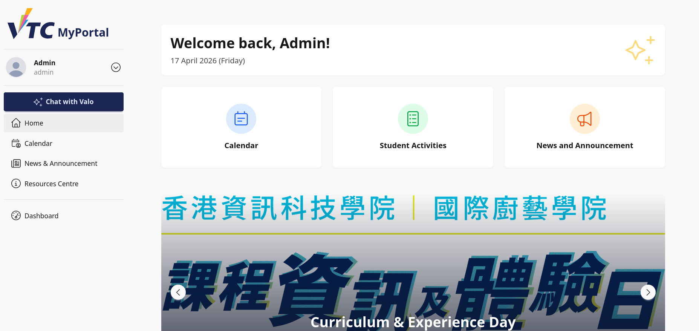
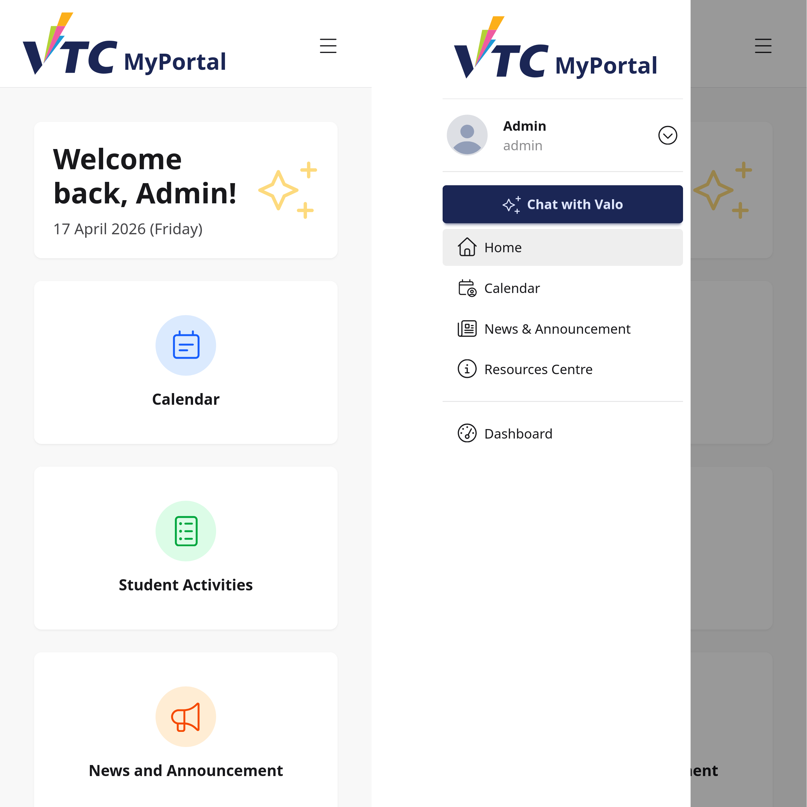
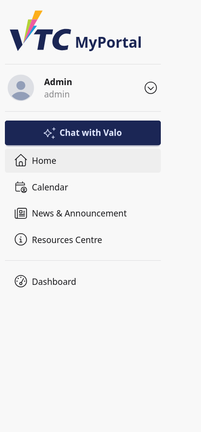
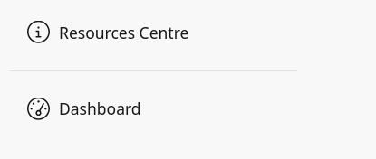

# 3. Portal Navigation

## 3.1 Purpose
This chapter explains how staff/admin users navigate the portal layout and move between portal modules and Dashboard.

Scope:
- Mobile navigation bar and drawer behavior
- Sidebar menu structure for staff/admin
- Role-based menu visibility differences
- Quick access to Dashboard

## 3.2 Portal Layout Structure
The portal layout contains:
1. Mobile top navigation with drawer trigger
2. Sidebar menu for primary navigation
3. Main content area for selected page

## 3.3 Mobile Top Navigation Behavior
On mobile devices:
- Brand is displayed on top navigation.
- Menu icon opens the sidebar drawer.

Use flow:
1. Tap menu icon.
2. Drawer opens with menu items.
3. Select desired item.

## 3.4 Sidebar Menu for Staff/Admin
Typical staff/admin portal sidebar includes:
- User profile block
- Chat with Valo button
- Home
- Calendar
- News and Announcement
- Resources Centre
- Dashboard (separated section)

Important role behavior:
- Student-only entries (Profile submenu, Student Activities) are not shown to staff/admin accounts.

## 3.5 Chat with Valo Access
A prominent Chat with Valo button appears near the top of the sidebar.

How to use:
1. Select Chat with Valo.
2. Assistant interface opens in portal context.

## 3.6 Core Portal Links
Staff/admin users can access core portal pages:
- Home
- Calendar
- News and Announcement
- Resources Centre

These links are available before moving into dashboard management modules.

## 3.7 Dashboard Entry Point
Staff/admin accounts have an additional Dashboard menu item at the bottom section after a separator.

How to use:
1. Select Dashboard.
2. System enters dashboard management area.

Operational note:
- Dashboard visibility is role-gated and appears only for staff/admin users.

## 3.8 Desktop and Mobile Differences
Desktop:
- Sidebar remains visible.
- Faster direct access between modules.

Mobile:
- Sidebar is hidden in drawer until opened.
- Requires top bar menu interaction before selecting links.

## 3.9 Typical Staff/Admin Navigation Workflows
### Workflow A: Move from Portal to Dashboard
1. Open sidebar.
2. Select Dashboard.
3. Continue to required management module.

### Workflow B: Review Announcements from Portal
1. Select News and Announcement.
2. Review content.
3. Return to Dashboard when management action is needed.

### Workflow C: Open Resource Documents
1. Select Resources Centre.
2. Find required document group.
3. Download or review files.

### Workflow D: Use Assistant During Operations
1. Select Chat with Valo.
2. Ask operation-related question.
3. Return to portal or dashboard via sidebar.

## 3.10 Role Visibility Reference
Menu visibility by role in this layout:
- Student: Profile submenu and Student Activities visible.
- Staff/Admin: Dashboard visible; student-only links hidden.

If menu visibility is unexpected, verify account role assignment.

## 3.11 Troubleshooting
### Case A: Dashboard Link Missing
- Confirm account has staff/admin role.
- Re-authenticate and retry.
- Escalate role mapping issue if persistent.

### Case B: Drawer Does Not Open on Mobile
- Tap menu icon again.
- Refresh page.
- Check browser/device compatibility.

### Case C: Incorrect Menu Items for Current User
- Session may be stale or mismatched.
- Sign out and sign in again.
- Confirm account role with system administrator.

### Case D: Menu Link Navigation Issue
- Retry from Home.
- Clear browser cache if route state appears outdated.

## 3.12 Security and Operational Notes
- Confirm logged-in identity from sidebar user card before executing admin tasks.
- Do not leave sessions open on shared machines.
- Use Dashboard only with appropriate authorization and role scope.

## 3.13 Escalation Information
When reporting navigation issues, provide:
- Username and role (staff/admin)
- Device type and browser
- Menu item selected
- Expected destination and actual behavior
- Screenshot of sidebar and top bar state
