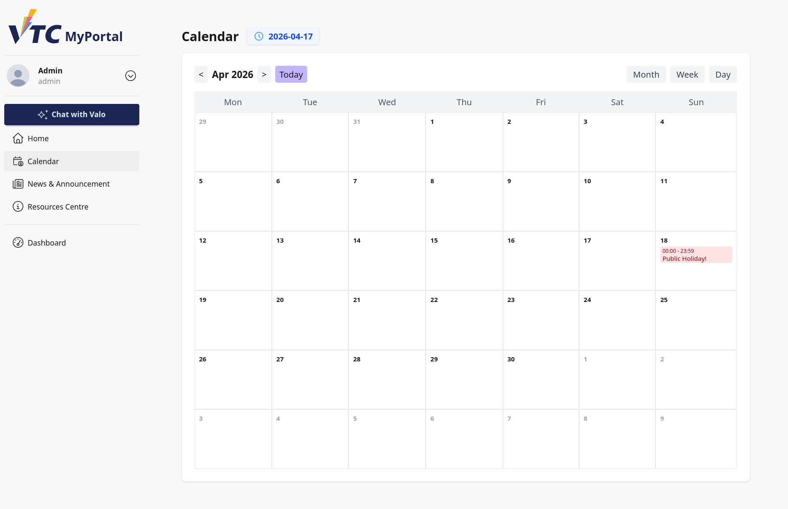
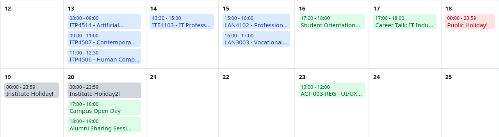
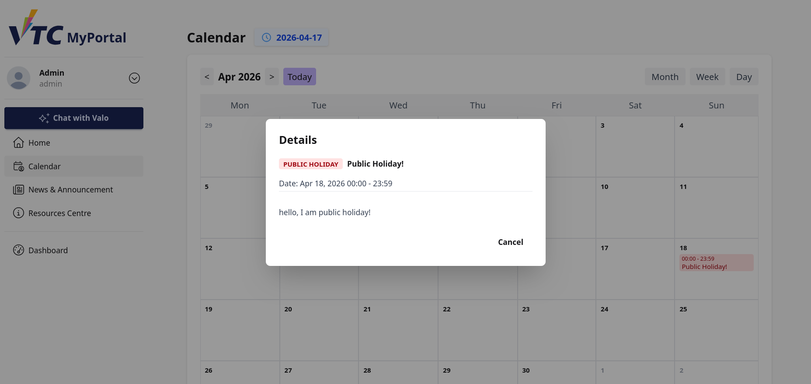

# 5. Calendar

## 5.1 Purpose
This section explains how staff and admin users use the Calendar page in VTC MyPortal.

The Calendar supports date-based visibility of events through Month, Week, and Day views with a detailed event modal.

## 5.2 Role-Based Visibility Notes
Calendar content is role-dependent.

### 5.2.1 Admin Users
Admin users on this portal calendar view are limited to:
- Public holiday events

### 5.2.2 Staff Users
Staff visibility may vary by account data and assigned scope.

Operational recommendation:
- If expected events are missing, verify role mapping and data association with system administrators.

## 5.3 Access the Calendar
Open Calendar from portal navigation points such as Home page quick access or service links.

## 5.4 Page Structure
Top area:
- **Calendar** title
- Current date indicator

Control row:
- Previous/next arrows
- Period label
- **Today** action
- View selectors: **Month**, **Week**, **Day**

Main display:
- Dynamic calendar grid according to selected view
- Clickable event chips

## 5.5 Calendar Views
### 5.5.1 Month View
Features:
- Month grid (Mon to Sun)
- Event entries inside day cells
- Compact/truncated labels

Steps:
1. Select **Month**.
2. Use `<` and `>` to switch month.
3. Select any event to view details.

### 5.5.2 Week View
Features:
- 7-day columns
- All-day event row
- 24-hour timeline (00-23)

Steps:
1. Select **Week**.
2. Navigate with `<` and `>`.
3. Review all-day and hourly events.
4. Select event item for details.

### 5.5.3 Day View
Features:
- Single date timeline
- All-day row
- 24-hour time slots

Steps:
1. Select **Day**.
2. Navigate by day using `<` and `>`.
3. Select events to open detail modal.

## 5.6 Today Shortcut
Use **Today** to instantly return to the current date context in all views.

Recommended use:
- After browsing historical/future dates, select **Today** before continuing daily operations.

## 5.7 Event Categories and Color Coding
Event entries use color classes by event type:
- Class
- Activity
- Public holiday
- Institute holiday

Note:
- Admin users may only observe public holiday category in this calendar context.

## 5.8 Event Details Modal
Selecting an event opens a detail modal containing available metadata:
- Event type
- Title
- Date/time or whole-day flag
- Location
- Instructor
- Description

Close modal using **Cancel**.

## 5.9 Typical Staff/Admin Workflows
### Workflow A: Verify Public Holiday Schedule (Admin)
1. Open Calendar.
2. Select **Month** view.
3. Navigate to target month.
4. Select holiday entry for details.

### Workflow B: Review Week Timeline
1. Select **Week** view.
2. Check date columns and hourly rows.
3. Open event details where needed.

### Workflow C: Validate Single-Day Event Timing
1. Select **Day** view.
2. Move to required date.
3. Open event chip and confirm time/location.

## 5.10 Troubleshooting
### Case A: Missing Expected Events
- Confirm your role and permissions.
- Verify date range and selected view.
- Use **Today** to reset.

### Case B: Event Information Is Incomplete
- Some fields (location/instructor/description) are optional.
- Check source event record if details are required.

### Case C: Navigation Appears Incorrect
- Refresh page and retry.
- Re-enter target date using view navigation controls.

### Case D: Modal Does Not Open
- Retry selecting event chip.
- Refresh page or use another supported browser.

## 5.11 Security and Operational Guidance
- Validate event interpretation against official academic/administrative notices.
- Do not rely on cached screenshots for critical date decisions.
- Report role-based visibility mismatches promptly.

## 5.12 Escalation Information
When escalating a calendar issue, include:
- Username and role (staff/admin)
- View mode and date range used
- Example missing/incorrect event
- Screenshot and timestamps
- Browser and OS details
