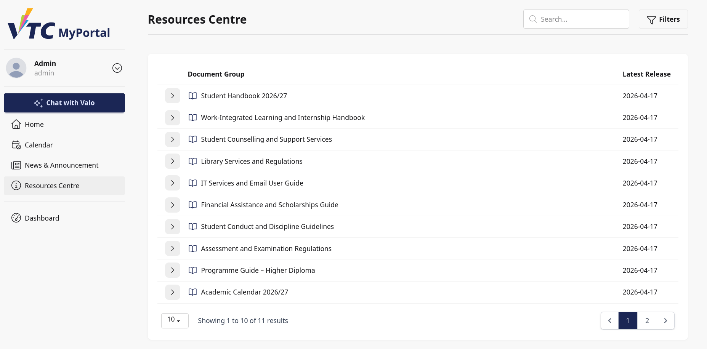
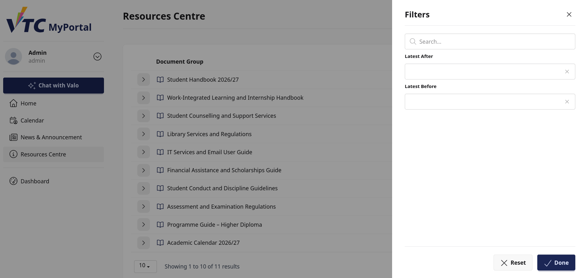
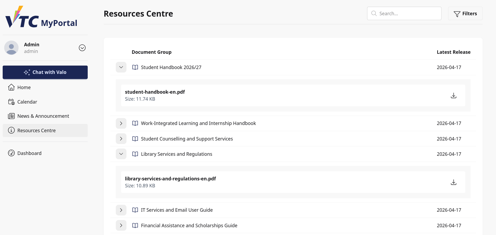
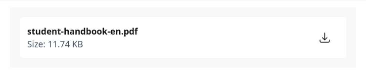

# 7. Resources Centre

## 7.1 Purpose
This chapter explains how staff and admin users access and retrieve documents from the portal Resources Centre page.

This page provides searchable document groups with downloadable files.

## 7.2 Accessing Resources Centre
Staff/admin users can open Resources Centre from portal navigation paths and service links.

## 7.3 Interface Structure
Key interface elements:
- Page title: Resources Centre
- Search input
- Filters control
- Document Group table
- Latest Release date column
- Expandable rows for file-level details
- Download action per file
- Pagination and per-page selector

## 7.4 Search and Date Filtering
### 7.4.1 Keyword Search
Enter text in Search to locate matching document groups.

### 7.4.2 Filter Drawer
Open Filters for date-based narrowing.

Supported criteria:
- Latest After
- Latest Before

Drawer actions:
- Reset
- Done

Operational recommendation:
- Apply date range first, then keyword refinement for large result sets.

## 7.5 Expand Rows to View Files
Each table row can be expanded to reveal associated files.

In expanded section, each file entry provides:
- File name
- File size (KB)
- Download button

If a group has no files, the row displays No files uploaded.

## 7.6 Download File Procedure
1. Expand a document group row.
2. Locate the target file.
3. Select the download icon/button.
4. File opens/downloads in a new tab/window.

## 7.7 Pagination and Throughput
Available rows per page:
- 5
- 10
- 15

Use higher values when reviewing multiple groups in one session.

## 7.8 Typical Staff/Admin Workflows
### Workflow A: Retrieve Latest Operational Document
1. Open Resources Centre.
2. Set Latest After filter.
3. Review Latest Release column.
4. Expand target group and download file.

### Workflow B: Locate Group by Name
1. Enter keyword in Search.
2. Open matching document group.
3. Download relevant file(s).

### Workflow C: Verify Missing File Situation
1. Expand expected document group.
2. Check file list.
3. If No files uploaded. appears, escalate to content owner.

## 7.9 Troubleshooting
### Case A: Expected Group Not Found
- Clear filters.
- Retry with alternative keywords.
- Validate date range boundaries.

### Case B: Download Link Not Working
- Check browser security/download settings.
- Retry in another supported browser.
- Validate network environment.

### Case C: Inconsistent Latest Release Date
- Refresh page.
- Reapply filters.
- Confirm that data may have been recently updated.

## 7.10 Security and Operational Notes
- Treat downloaded materials according to institutional data policy.
- Avoid sharing controlled documents outside authorized channels.
- Verify document version/date before operational use.

## 7.11 Escalation Information
When reporting issues, include:
- Username and role (staff/admin)
- Document group name
- Filter values used
- Target file name
- Screenshot and browser/OS details
