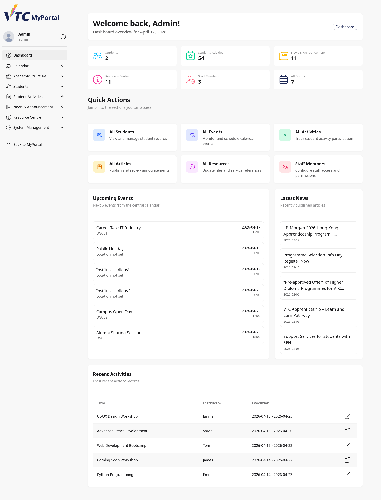
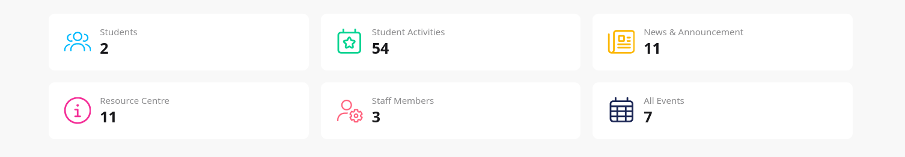
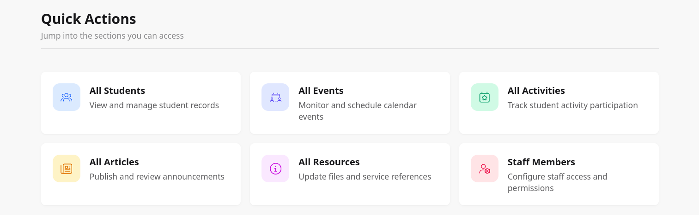
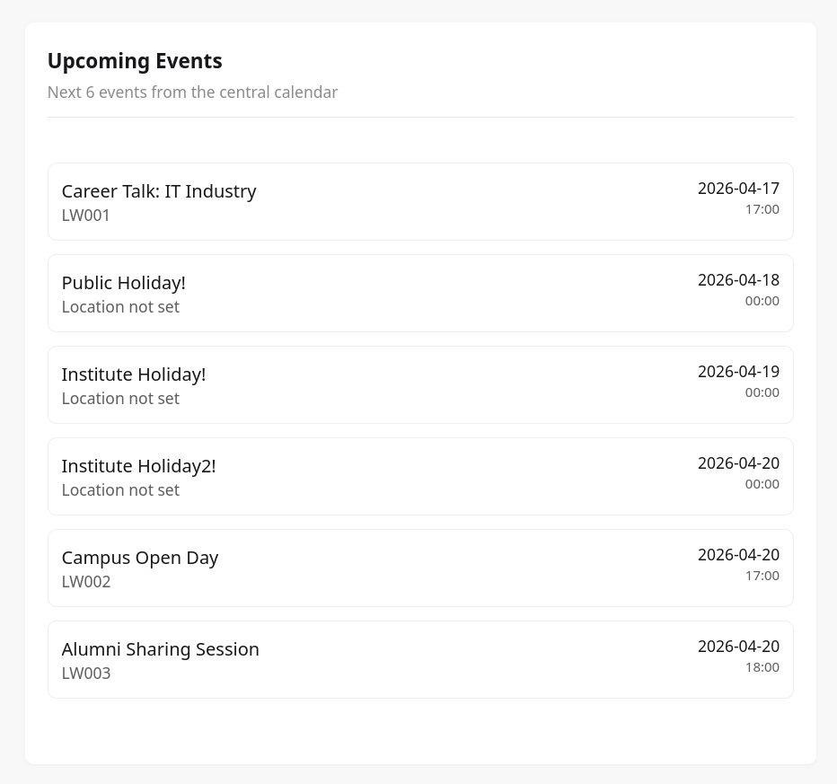
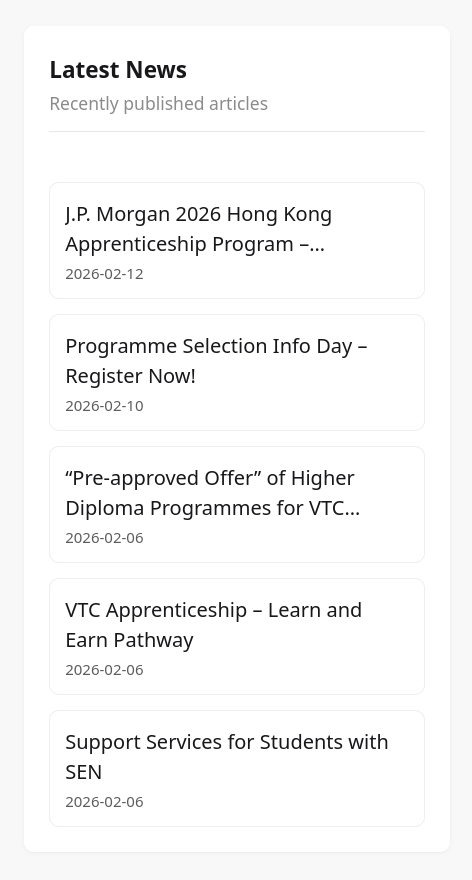
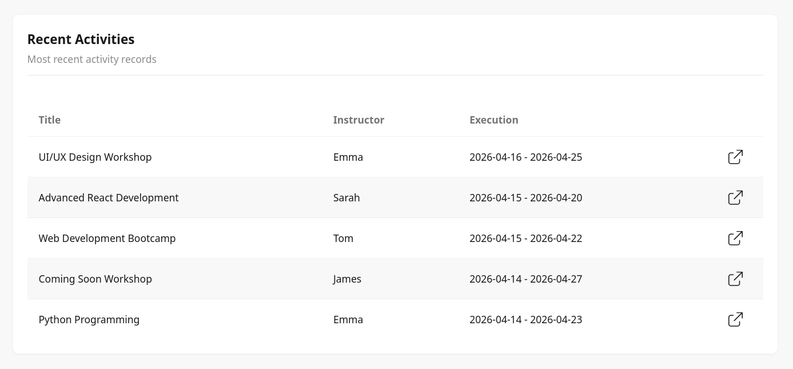

# 8. Dashboard: Home

## 8.1 Purpose
This chapter explains how staff and admin users use the Dashboard Home page in VTC MyPortal.

Dashboard Home provides an operational overview and fast navigation to core management modules.

## 8.2 Audience
This guide is for:
- Staff users with dashboard permissions
- Admin users with system-wide access

## 8.3 Access Dashboard Home
After signing in with a staff/admin account:
1. Open the dashboard area.
2. Select Dashboard from the dashboard navigation.
3. Confirm the Home badge is visible on the page.

> Image placeholder: Dashboard Home entry and page landing state.

## 8.4 Page Layout Overview
Dashboard Home is structured into major sections:
1. Welcome summary card
2. KPI statistics grid
3. Quick Actions cards
4. Upcoming Events panel
5. Latest News panel
6. Recent Activities table

> Image placeholder: Full dashboard home with section annotations.

## 8.5 Welcome Summary Card
Top card displays:
- Welcome back message with signed-in given name
- Current date overview line
- Dashboard badge

Operational use:
- Confirm account identity and date context before performing updates.

## 8.6 KPI Statistics Grid
The statistics area provides high-level counts:
- Students
- Activities
- News
- Resource Centre
- Staff Members
- All Events (upcoming)

These counters help quickly assess data volume and current operational load.

> Image placeholder: KPI cards close-up.

## 8.7 Quick Actions Section
Quick Actions provides permission-based shortcuts to management pages.

Typical quick links include:
- All Students
- All Events
- All Activities
- All Articles
- All Resources
- Staff Members (admin-only)

Each card contains:
- Module icon
- Module title
- Short action description

Behavior:
- Only links allowed by your role/permission are displayed.

> Image placeholder: Quick Actions cards with role-dependent visibility.

## 8.8 Upcoming Events Panel
Upcoming Events shows the next six events from the central calendar.

Each entry may include:
- Event title
- Location (or Location not set)
- Date
- Time

If no events are available, the panel shows an empty-state message.

> Image placeholder: Upcoming Events panel with populated items.

## 8.9 Latest News Panel
Latest News lists recently published articles.

Each item includes:
- Article title
- Published date (or Not published date)

Selecting an item navigates to the article edit page.

If no articles exist, an empty-state message is shown.

> Image placeholder: Latest News panel and item navigation.

## 8.10 Recent Activities Section
Recent Activities displays a compact table of latest activity records.

Columns:
- Title
- Instructor
- Execution
- Open action button

Open action behavior:
- Arrow icon opens the selected activity edit page.

If no records exist, the section displays an empty-state message.

> Image placeholder: Recent Activities table and open action.

## 8.11 Role and Permission Behavior
Dashboard Home applies visibility controls:
- Staff users see cards/modules based on granted permissions.
- Admin users can additionally access admin-only areas such as Staff Members.

If a quick action is missing:
1. Confirm your assigned role.
2. Confirm module permission mapping.
3. Contact system administrator if access should be available.

## 8.12 Typical Staff/Admin Workflows
### Workflow A: Start Daily Operations
1. Open Dashboard Home.
2. Check KPI counters for overall status.
3. Review Upcoming Events and Latest News.
4. Jump into target module through Quick Actions.

### Workflow B: Review Event Pipeline
1. Check Upcoming Events panel.
2. Identify items with missing location/time concerns.
3. Use All Events quick link for full calendar management.

### Workflow C: Follow Up on Activity Records
1. Go to Recent Activities table.
2. Open a row using the action icon.
3. Review or update activity details.

### Workflow D: Admin Access Validation
1. Confirm Staff Members quick action is visible.
2. Open staff management for access review and permission updates.

## 8.13 Troubleshooting
### Case A: Quick Action Card Missing
- Verify role and permissions.
- Re-login to refresh session context.
- Escalate to admin for permission check.

### Case B: Counter Values Look Incorrect
- Refresh the page.
- Compare with module list totals.
- Report discrepancy with timestamp and screenshots.

### Case C: No Upcoming Events or News
- Section may legitimately be empty.
- Confirm source modules contain records.
- Validate published status/date conditions in source module.

### Case D: Navigation Link Does Not Open
- Retry with stable network.
- Open in another supported browser.
- Check whether target route requires additional permission.

## 8.14 Security and Operational Notes
- Verify account identity from welcome section before performing edits.
- Use dashboard metrics as quick indicators, then confirm details inside each module.
- Avoid leaving dashboard sessions unattended on shared workstations.

## 8.15 Escalation Information
When reporting Dashboard Home issues, include:
- Username and role (staff/admin)
- Section affected (KPI, quick action, events, news, activities)
- Expected vs actual behavior
- Timestamp and screenshot
- Browser and OS details
