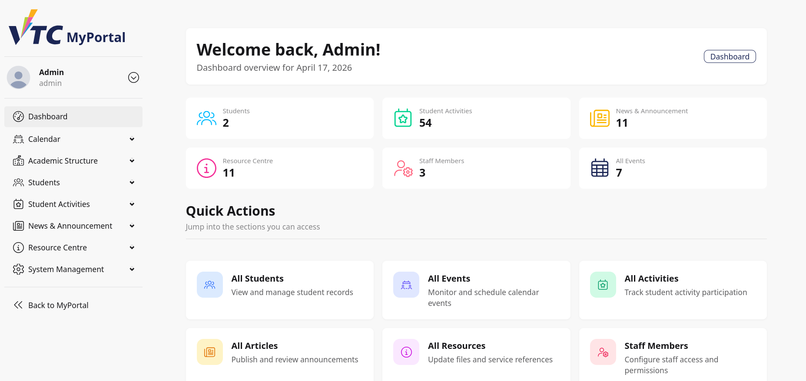
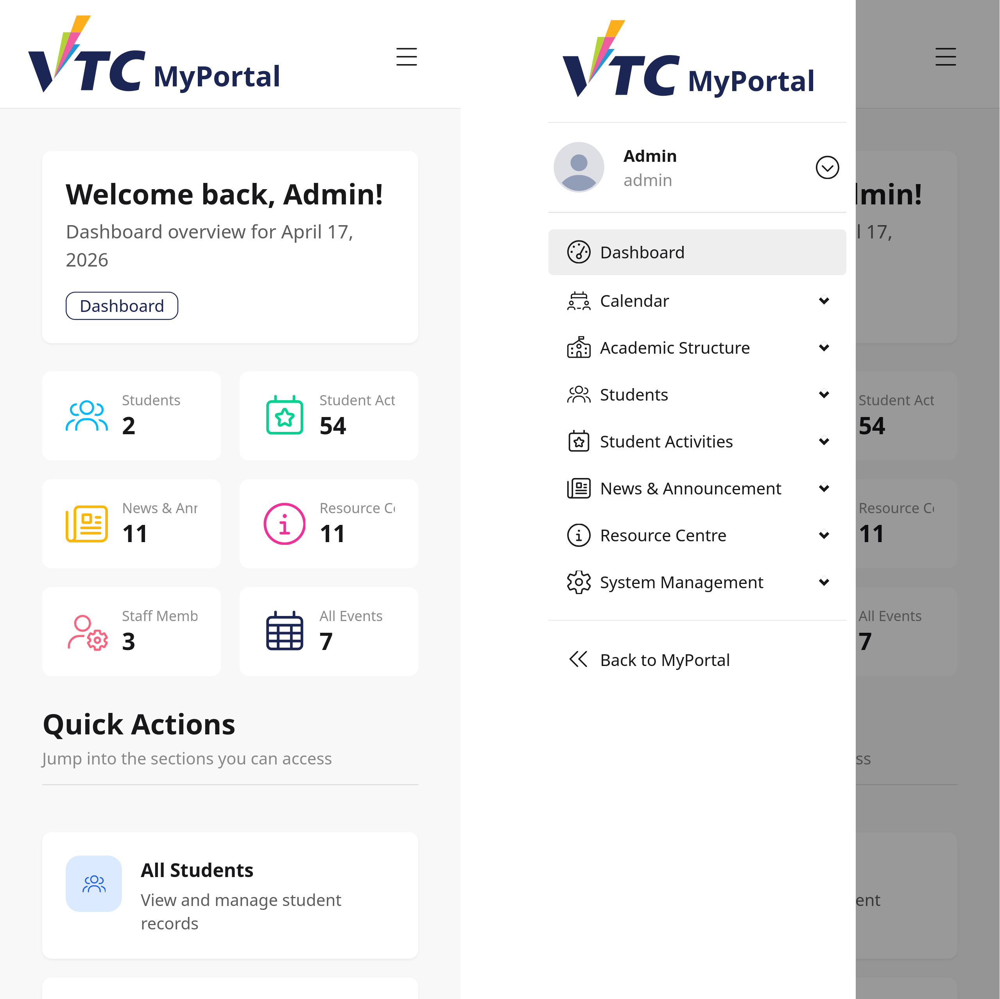
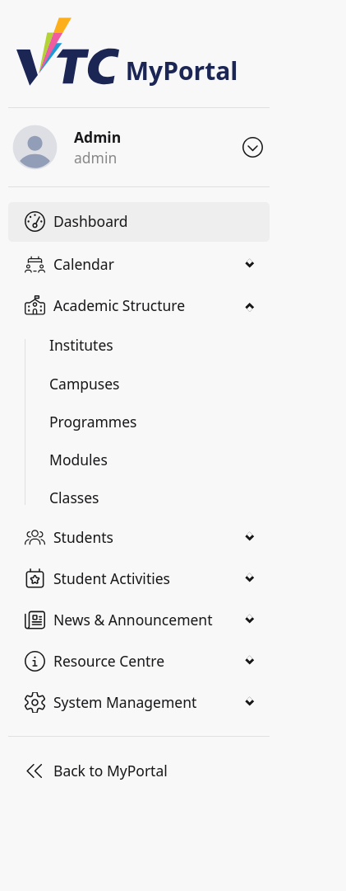
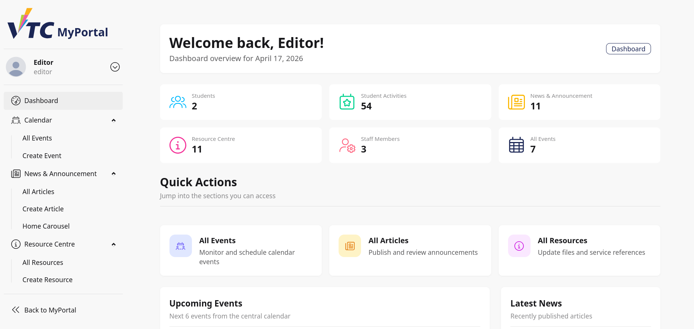
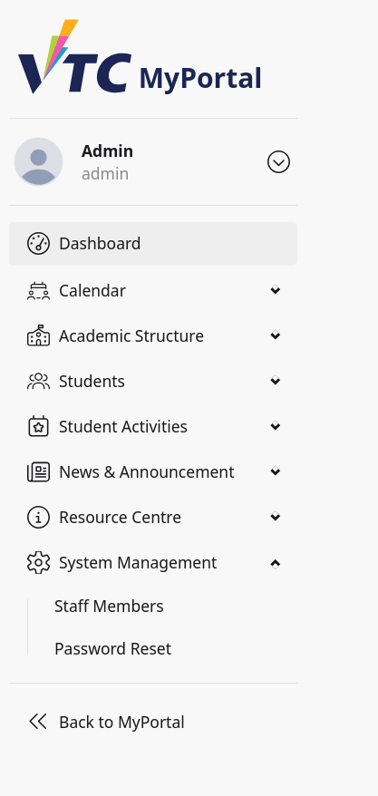

# 9. Dashboard: Navigation

## 9.1 Purpose
This chapter explains how staff and admin users navigate the Dashboard layout, including role-based and permission-based menu visibility.

Scope:
1. Mobile top navigation and drawer trigger
2. Dashboard sidebar menu structure
3. Permission-controlled menu sections
4. Admin-only system section
5. Back to portal navigation

## 9.2 Dashboard Layout Overview
The dashboard layout contains:
- Mobile top navigation bar (small screens)
- Left sidebar menu (always visible on desktop, drawer on mobile)
- Main content area

## 9.3 Mobile Navigation Behavior
On mobile (small screen):
- A compact top bar is shown.
- The menu icon opens the main drawer.
- Sidebar items are accessed through the drawer.

How to use:
1. Tap the menu icon in the top bar.
2. Drawer opens with dashboard menu.
3. Select a destination.

## 9.4 Sidebar Core Structure
The sidebar typically includes:
- Brand/logo
- Sidebar user profile block
- Dashboard Home
- Permission-based menu groups
- Separator
- Back to MyPortal link

Home link:
- Dashboard Home is always present in this layout.

## 9.5 Permission-Based Menu Groups
Each menu group appears only when the logged-in user has the corresponding permission.

### 9.5.1 Calendar Group
Visible when user has calendar permission.

Sub-items:
- All Events
- Create Event

### 9.5.2 Academic Structure Group
Visible when user has academic permission.

Sub-items:
- Institutes
- Campuses
- Programmes
- Modules
- Classes

### 9.5.3 Students Group
Visible when user has students permission.

Sub-items:
- All Students
- Create Student
- Batch Import

### 9.5.4 Student Activities Group
Visible when user has activities permission.

Sub-items:
- All Activities
- Create Activities

### 9.5.5 News and Announcement Group
Visible when user has news permission.

Sub-items:
- All Articles
- Create Article
- Home Carousel

### 9.5.6 Resource Centre Group
Visible when user has resources permission.

Sub-items:
- All Resources
- Create Resource

## 9.6 Admin-Only System Management Group
System Management appears only for admin role.

Sub-items:
- Staff Members
- Password Reset

Key role rule:
- Staff users do not see the System Management group unless they are admin.

## 9.7 Back to MyPortal Link
At the bottom of the sidebar (after separator), Back to MyPortal is always available.

Use this to:
- Leave dashboard management area
- Return to portal home

## 9.8 Typical Navigation Workflows
### Workflow A: Start Daily Operations
1. Open Dashboard.
2. Select Home for overview.
3. Enter needed management module from permission group.

### Workflow B: Jump to Student Management
1. Open Students group.
2. Choose All Students, Create Student, or Batch Import.

### Workflow C: Manage News and Carousel
1. Open News and Announcement group.
2. Choose All Articles, Create Article, or Home Carousel.

### Workflow D: Admin Account Operations
1. Open System Management.
2. Choose Staff Members or Password Reset.

### Workflow E: Return to Portal
1. Select Back to MyPortal.
2. Continue user-facing portal tasks.

## 9.9 Role and Permission Visibility Matrix
Expected visibility summary:
- Home: visible to all dashboard users
- Permission groups: visible only if permission granted
- System Management: visible to admin role only
- Back to MyPortal: visible to all dashboard users

If expected menu items are missing, verify role and permission assignment.

## 9.10 Troubleshooting
### Case A: Sidebar Item Missing
- Confirm account permissions include the module.
- Re-authenticate to refresh session.
- Ask admin to verify permission mapping.

### Case B: System Management Missing
- Confirm current account role is admin.
- Staff role will not show this group.

### Case C: Drawer Not Opening on Mobile
- Tap menu icon again.
- Refresh the page.
- Check browser or device compatibility.

### Case D: Wrong Destination After Click
- Return to Dashboard Home and retry.
- Clear browser cache if stale route behavior persists.

## 9.11 Security and Operational Notes
- Confirm identity from sidebar user card before sensitive actions.
- Use least privilege principle for permission assignment.
- Sign out after use on shared workstations.

## 9.12 Escalation Information
When reporting dashboard navigation issues, provide:
- Username and role
- Expected menu item and missing item
- Device type (mobile or desktop)
- Screenshot of sidebar and current page
- Browser and OS details
