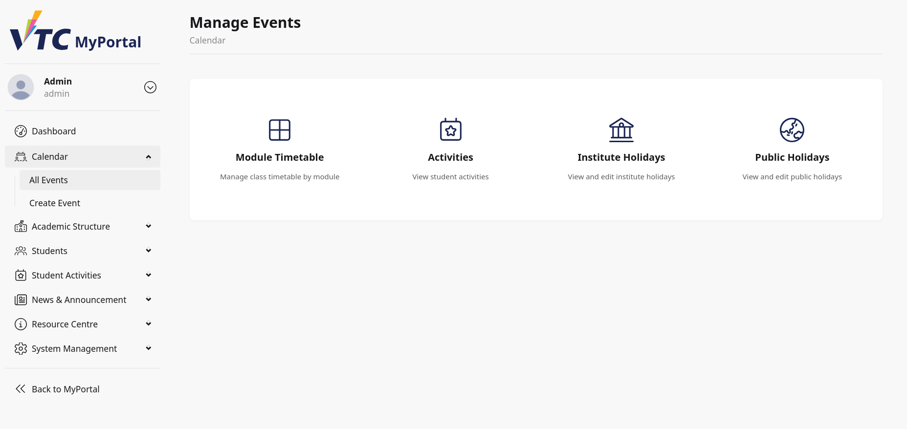
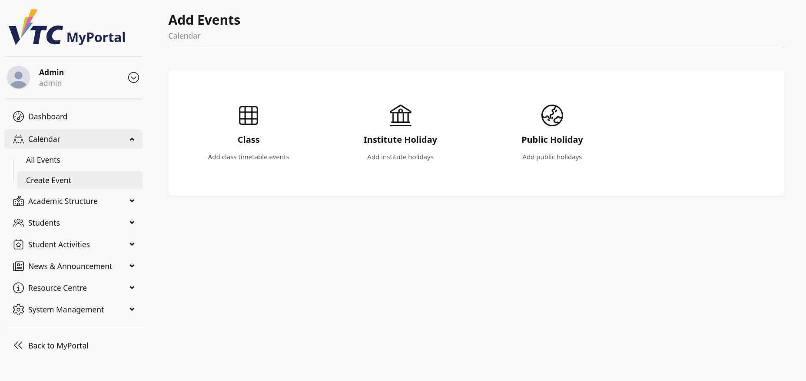
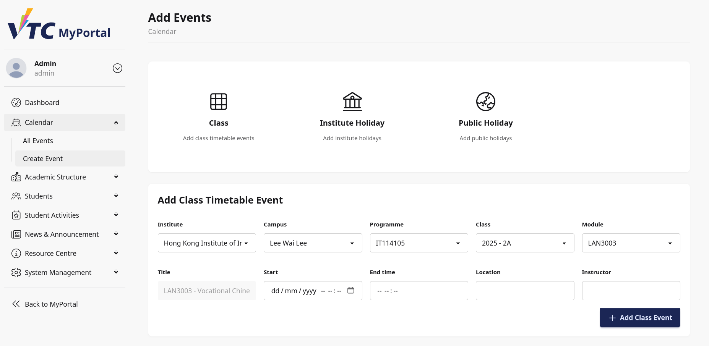
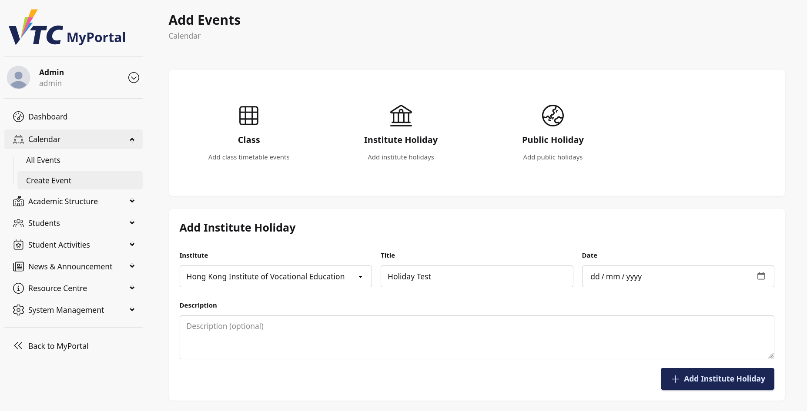
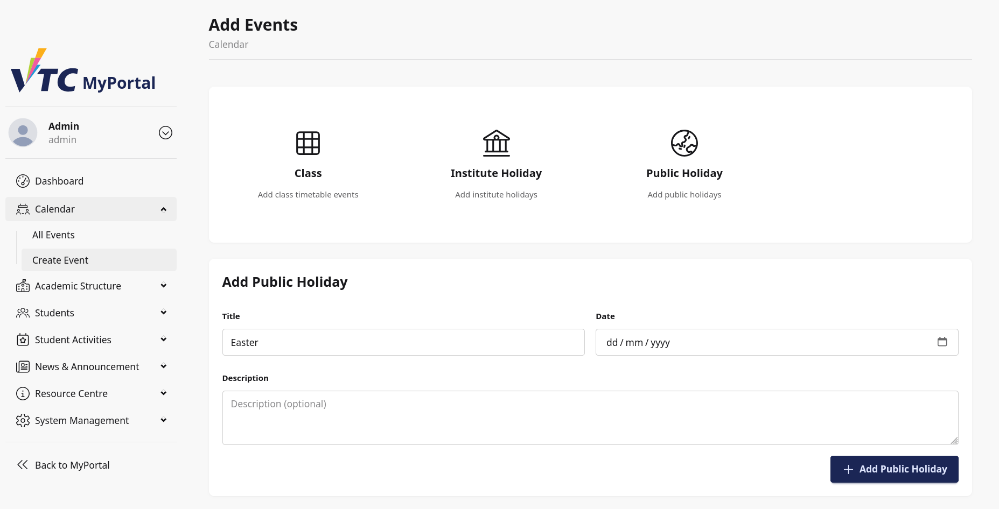
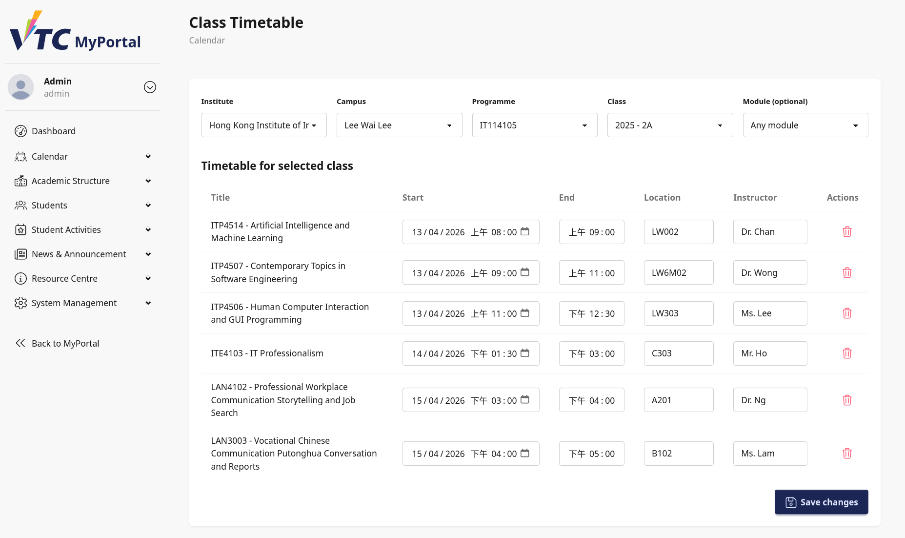
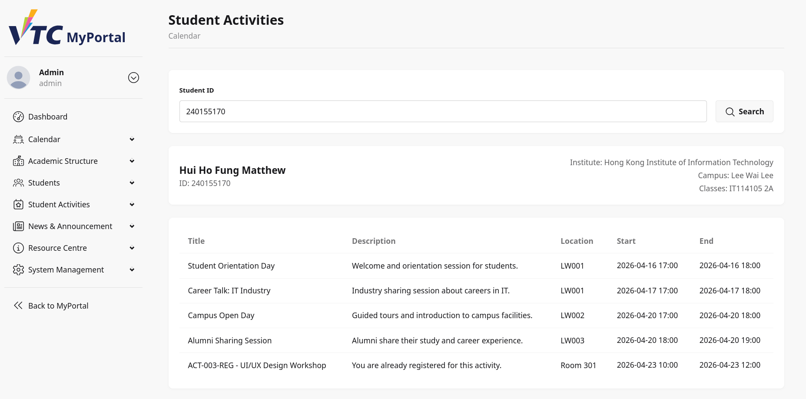
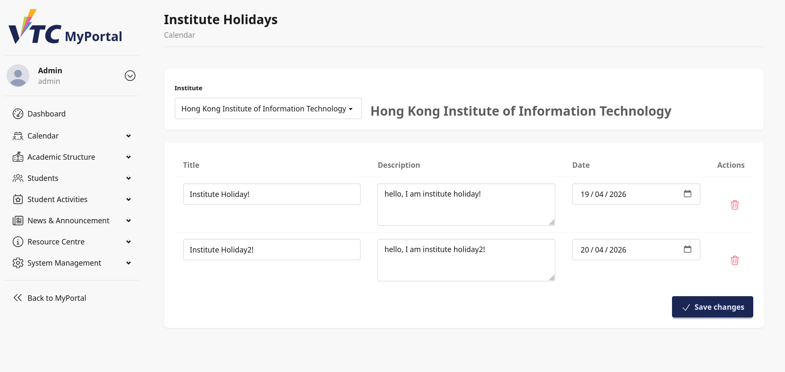
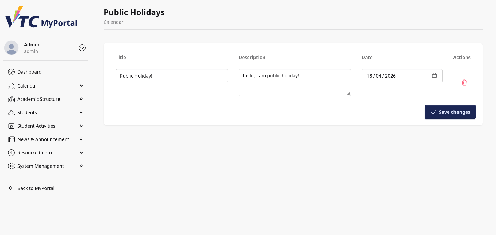

# 10. Dashboard: Calendar

## 10.1 Purpose
This chapter explains how staff and admin users manage calendar records in the Dashboard Calendar module.

Pages covered in this chapter:
1. Calendar Manage landing page
2. Add Events page
3. Module Timetable management page
4. Activities calendar management page
5. Institute Holidays management page
6. Public Holidays management page

## 10.2 Module Entry Points
From dashboard navigation, users can typically access:
- All Events (Add Events page)
- Calendar (Manage landing page)

The Manage landing page provides direct cards to the four management subpages:
- Module Timetable
- Activities
- Institute Holidays
- Public Holidays

> Image placeholder: Dashboard navigation path to Calendar module.

## 10.3 Calendar Manage Landing Page
The landing page shows clickable management cards.

Each card opens a specific workflow:
- Module Timetable: Manage class timetable by module/class
- Activities: View activity events for a specific student
- Institute Holidays: View and edit institute-specific holidays
- Public Holidays: View and edit global public holidays

> Image placeholder: Calendar manage landing cards.

## 10.4 Add Events Page (All Events)
The Add Events page supports creating new calendar records for:
1. Class timetable events
2. Institute holidays
3. Public holidays

The page begins with three selection cards, each opening a dedicated form.

> Image placeholder: Add Events page with three creation cards.

## 10.5 Create Class Timetable Event
Select Class to open the class event form.

### 10.5.1 Required Selection Flow
Complete the hierarchical selectors in order:
1. Institute
2. Campus
3. Programme
4. Class
5. Module

After selecting module, title is auto-generated from module code and name.

### 10.5.2 Event Input Fields
Provide:
- Title (auto-filled, read-only)
- Start (date and time)
- End time
- Location (optional)
- Instructor (optional)

### 10.5.3 Save Action
Select Add Class Event to create the record.

Expected result:
- Success message confirms creation.
- Start/end values reset for next entry.

> Image placeholder: Class timetable event form in completed state.

## 10.6 Create Institute Holiday
Select Institute Holiday to open institute holiday form.

Fields:
- Institute
- Title
- Date
- Description (optional)

Action:
- Select Add Institute Holiday.

Expected result:
- Holiday is created as all-day event for selected institute.
- Success message is displayed.

> Image placeholder: Create institute holiday form.

## 10.7 Create Public Holiday
Select Public Holiday to open public holiday form.

Fields:
- Title
- Date
- Description (optional)

Action:
- Select Add Public Holiday.

Expected result:
- Public holiday is created as all-day global event.
- Success message is displayed.

> Image placeholder: Create public holiday form.

## 10.8 Module Timetable Management
Open Module Timetable from Calendar Manage landing page.

### 10.8.1 Filter and Selection Flow
Use selectors in sequence:
1. Institute
2. Campus
3. Programme
4. Class
5. Module (optional)

Behavior:
- Class selection loads timetable events.
- Module selection narrows results by module code prefix.

### 10.8.2 Editable Timetable Fields
For each event row, editable fields include:
- Start (datetime)
- End (time)
- Location
- Instructor

Title is shown as reference.

### 10.8.3 Delete and Save
- Trash action marks an event for deletion.
- Save changes applies edits and deletions together.

Expected result:
- Success confirmation appears.
- Table reloads current saved state.

> Image placeholder: Module timetable table with edit and delete actions.

## 10.9 Activities Calendar Management
Open Activities from Calendar Manage landing page.

This page manages activity-type calendar events tied to a specific student.

### 10.9.1 Search Student
1. Enter Student ID.
2. Select Search.

On success:
- Student profile summary is displayed.
- Current activity events are listed.

If not found:
- Error message indicates student not found.

### 10.9.2 Event Display
For each activity event, table shows:
- Title
- Description (truncated)
- Location
- Start
- End

Current implementation is read-focused in the table view.

> Image placeholder: Activities management search and result table.

## 10.10 Institute Holidays Management
Open Institute Holidays from Calendar Manage landing page.

### 10.10.1 Select Institute
1. Choose institute.
2. Existing holidays for that institute load into editable rows.

### 10.10.2 Editable Fields
Per row:
- Title
- Description
- Date

### 10.10.3 Delete and Save
- Trash action marks a row for deletion.
- Save changes applies all edits/deletions.

Expected result:
- Success message confirms update.

> Image placeholder: Institute holidays editable table.

## 10.11 Public Holidays Management
Open Public Holidays from Calendar Manage landing page.

The page displays editable rows for all public holidays.

Editable fields:
- Title
- Description
- Date

Actions:
- Delete row via trash icon
- Save changes

Expected result:
- Success message confirms update.

> Image placeholder: Public holidays editable table.

## 10.12 Typical Staff/Admin Workflows
### Workflow A: Create New Class Session
1. Open All Events.
2. Select Class.
3. Complete institute-to-module selection chain.
4. Enter start/end, location, instructor.
5. Select Add Class Event.

### Workflow B: Correct Timetable Details
1. Open Module Timetable.
2. Filter to class/module.
3. Edit time/location/instructor.
4. Save changes.

### Workflow C: Maintain Holiday Calendars
1. Open Institute Holidays or Public Holidays.
2. Edit titles/descriptions/dates.
3. Delete outdated rows if needed.
4. Save changes.

### Workflow D: Verify Student Activity Events
1. Open Activities management.
2. Search by student ID.
3. Review activity event rows for schedule validation.

## 10.13 Troubleshooting
### Case A: Dropdown Options Not Appearing
- Ensure prior selectors are completed in required order.
- Re-select institute/programme/class to refresh dependent options.

### Case B: Save Has No Effect
- Confirm at least one editable value changed.
- Check validation requirements for date/time fields.
- Retry and verify success toast message.

### Case C: Student Search Fails
- Verify student ID format and existence.
- Retry with exact username-based student ID.

### Case D: No Events Loaded
- Confirm selected filters match existing records.
- Remove optional module filter to broaden results.

### Case E: Holiday List Empty
- No records may be configured yet.
- Use Add Events page to create initial holiday entries.

## 10.14 Data and Operational Notes
- Class timetable edits directly affect schedule visibility downstream.
- Holiday updates should follow institutional calendar governance.
- Validate event time ranges carefully before saving.

## 10.15 Escalation Information
When reporting dashboard calendar issues, include:
- Username and role (staff/admin)
- Subpage name (All Events, Module Timetable, Activities, Institute Holidays, Public Holidays)
- Selected filters/inputs used
- Record type and expected behavior
- Timestamp, screenshot, browser, and OS details
