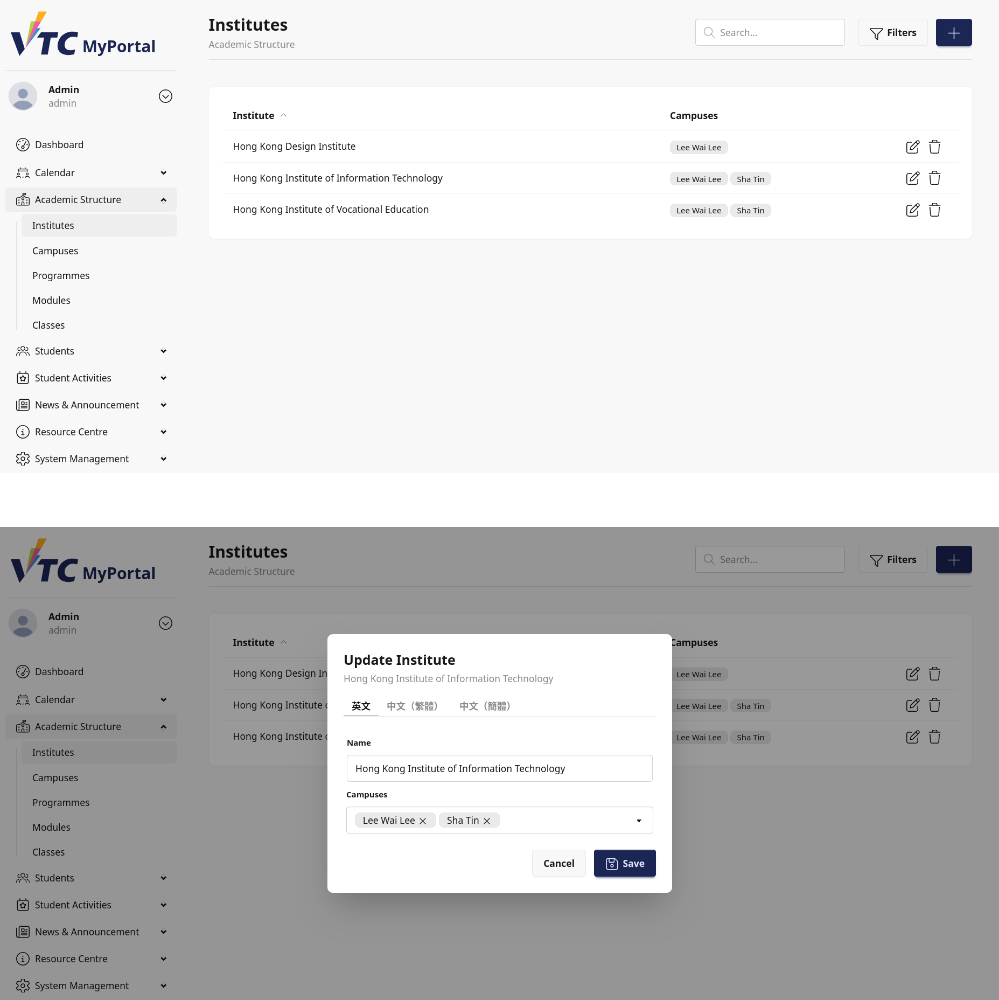
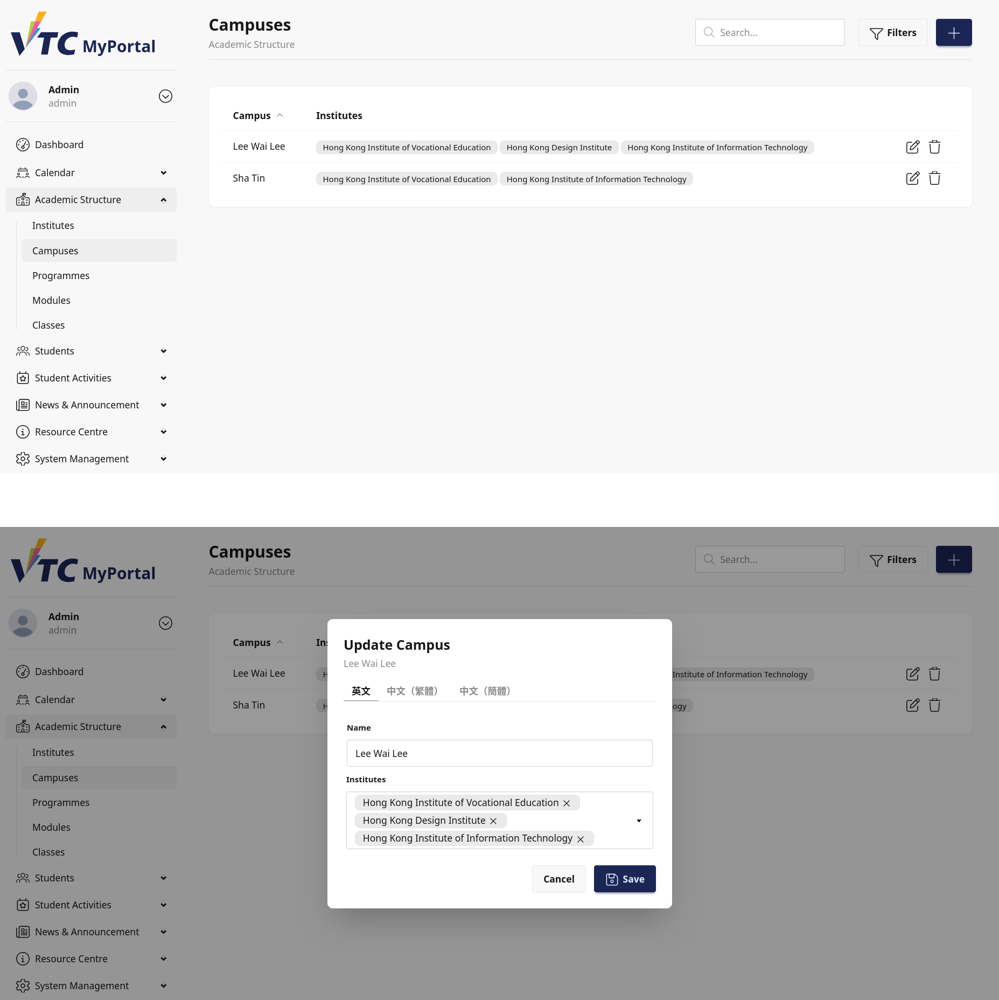
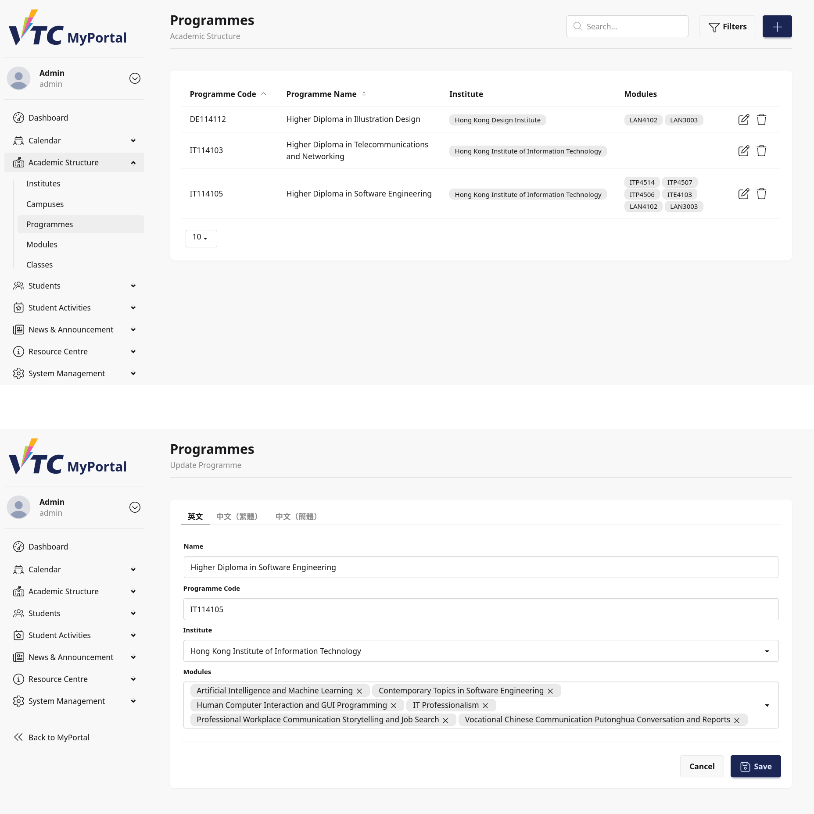
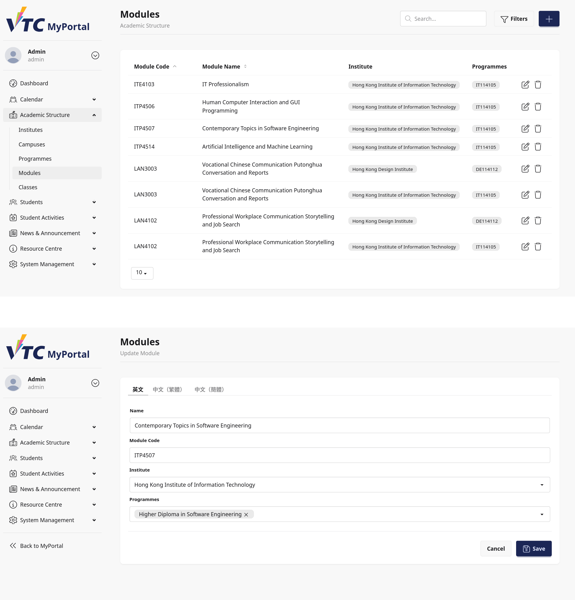
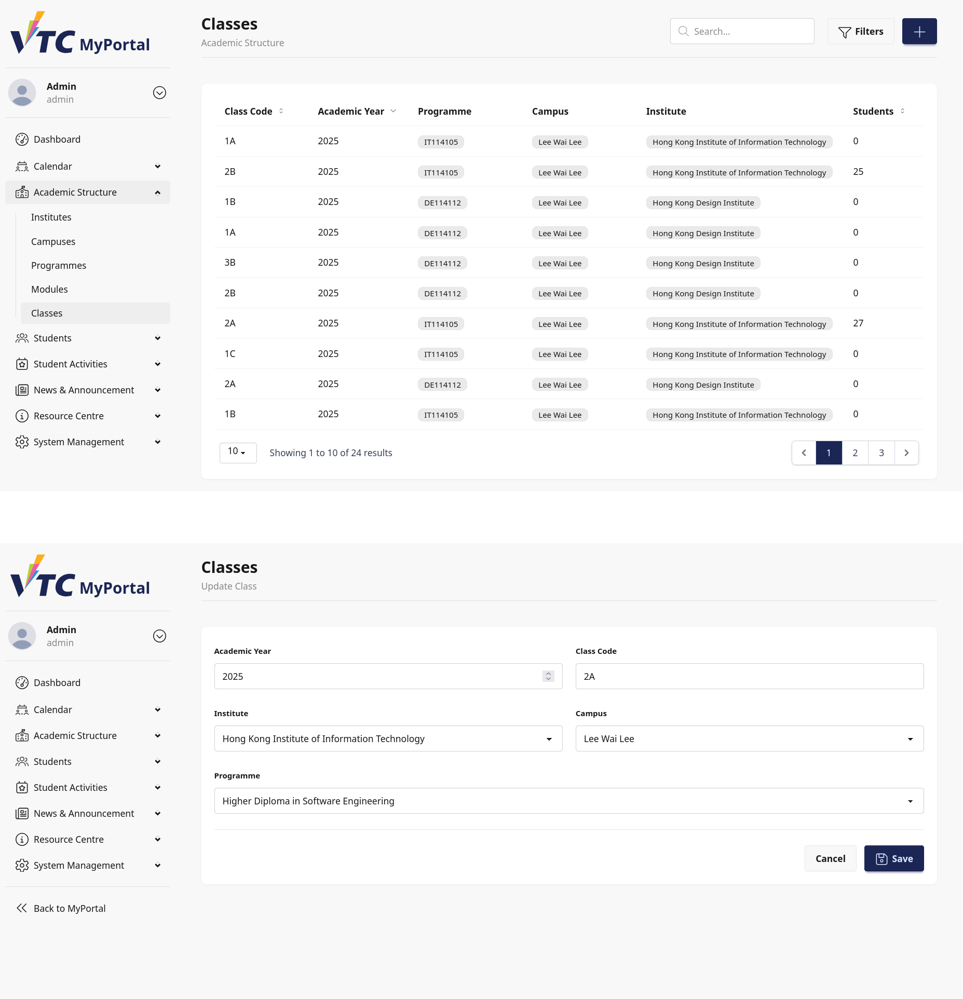

# 11. Dashboard: Academic Structure

## 11.1 Purpose
This chapter explains how staff/admin users manage academic structure data in Dashboard.

Scope of this chapter:
1. Institutes
2. Campuses
3. Programmes
4. Modules
5. Classes

The chapter covers list pages, filters, create/update forms, and deletion behavior.

## 11.2 Navigation Overview
Academic structure pages are accessed from Dashboard navigation under Academic Structure.

Primary list pages:
- Institutes
- Campuses
- Programmes
- Modules
- Classes

Secondary pages:
- Create/Edit Programme
- Create/Edit Module
- Create/Edit Class

> Image placeholder: Dashboard Academic Structure navigation map.

## 11.3 Common Interface Patterns
Most list pages share these UI patterns:
- Header with title/subtitle
- Search input
- Filters drawer
- Data table with sortable columns
- Row-level actions (Edit/Delete)
- Responsive overflow menu on small screens

Common actions in filter drawer:
- Reset
- Done

Common edit form actions:
- Cancel
- Save or Create

## 11.4 Institutes Management
Reference page: Institutes list.

### 11.4.1 List and Filters
Institutes list supports:
- Keyword search by institute name
- Filter by associated campus
- Sorting by institute name

Table columns:
- Institute
- Campuses

### 11.4.2 Create and Update Institute
Institute form opens in a modal.

Fields:
- Multilingual Name (tabbed by language)
- Campuses (multi-select)

Modal title changes by mode:
- Create Institute
- Update Institute

### 11.4.3 Delete Institute
Delete action removes the selected institute.

Operational note:
- Ensure institute dependency checks are completed before deletion.

> Image placeholder: Institutes list and modal form.

## 11.5 Campuses Management
Reference page: Campuses list.

### 11.5.1 List and Filters
Campuses list supports:
- Keyword search by campus name
- Filter by associated institute
- Sorting by campus name

Table columns:
- Campus
- Institutes

### 11.5.2 Create and Update Campus
Campus form opens in a modal.

Fields:
- Multilingual Name (tabbed)
- Institutes (multi-select)

Modal title changes by mode:
- Create Campus
- Update Campus

### 11.5.3 Delete Campus
Delete action removes the selected campus.

> Image placeholder: Campuses list and modal form.

## 11.6 Programmes Management
Reference pages:
- Programmes list
- Programme create/edit form

### 11.6.1 Programmes List
Features:
- Keyword search by programme code/name
- Filter by institute
- Sorting by programme code or translated name
- Pagination

Table columns:
- Programme Code
- Programme Name
- Institute
- Modules

### 11.6.2 Create/Edit Programme
Form fields:
- Multilingual Name (tabbed)
- Programme Code
- Institute
- Modules (multi-select)

Validation behavior highlights:
- Programme Code must be unique
- Selected modules must belong to the selected institute
- Changing institute automatically narrows module options

### 11.6.3 Delete Programme
Delete is available on list row action.

If in use:
- System shows an error message and deletion is blocked.

> Image placeholder: Programmes list and edit form.

## 11.7 Modules Management
Reference pages:
- Modules list
- Module create/edit form

### 11.7.1 Modules List
Features:
- Keyword search by module code/name
- Filter by institute
- Sorting by module code or translated name
- Pagination

Table columns:
- Module Code
- Module Name
- Institute
- Programmes

### 11.7.2 Create/Edit Module
Form fields:
- Multilingual Name (tabbed)
- Module Code
- Institute
- Programmes (multi-select)

Validation behavior highlights:
- Module Code uniqueness is scoped by institute
- Selected programmes must belong to selected institute
- Changing institute narrows available programmes

### 11.7.3 Delete Module
Delete is available from list row action.

If referenced by dependencies:
- System blocks deletion and shows error message.

> Image placeholder: Modules list and edit form.

## 11.8 Classes Management
Reference pages:
- Classes list
- Class create/edit form

### 11.8.1 Classes List
Features:
- Keyword search by class code, academic year, and programme code
- Filters for institute, campus, programme
- Sorting and pagination
- Students count display

Table columns:
- Class Code
- Academic Year
- Programme
- Campus
- Institute
- Students

### 11.8.2 Create/Edit Class
Form fields:
- Academic Year
- Class Code
- Institute
- Campus
- Programme

Validation behavior highlights:
- Academic Year must be a 4-digit year
- Class Code format: ASCII alpha-dash
- Uniqueness is validated by combination of year + institute + campus + programme + class code
- Campus must be valid for selected institute
- Programme must belong to selected institute

### 11.8.3 Delete Class
Delete is available from list row actions.

If class is in use:
- System blocks deletion and shows message indicating in-use constraints.

> Image placeholder: Classes list and edit form.

## 11.9 Relationship Rules to Remember
Academic data is linked hierarchically.

Practical rules:
- Institute selection impacts available campuses/programmes/modules.
- Campus and programme options are constrained by selected institute.
- Programme-module and module-programme links are many-to-many.
- Class records connect institute, campus, and programme.

When changing higher-level selections, dependent fields may reset.

## 11.10 Typical Staff/Admin Workflows
### Workflow A: Add New Programme with Modules
1. Open Programmes list.
2. Select Create.
3. Fill multilingual names and programme code.
4. Select institute.
5. Select related modules.
6. Save.

### Workflow B: Add New Module and Assign to Programmes
1. Open Modules list.
2. Select Create.
3. Fill multilingual names and module code.
4. Select institute.
5. Select related programmes.
6. Save.

### Workflow C: Create New Class for Academic Year
1. Open Classes list.
2. Select Create.
3. Input academic year and class code.
4. Select institute, campus, and programme.
5. Save.

### Workflow D: Clean Up Unused Record
1. Locate target record in list page.
2. Try Delete.
3. If blocked by in-use constraints, remove dependencies first.

## 11.11 Troubleshooting
### Case A: Filter Options Seem Missing
- Select institute first.
- Dependent dropdown options only load after required parent selection.

### Case B: Save Fails with Validation Error
- Check required fields and uniqueness constraints.
- Confirm related entities belong to selected institute.

### Case C: Delete Fails
- Record is likely referenced by dependent data.
- Review linked records and detach dependencies before retrying.

### Case D: Wrong Language Name Display
- Ensure translations are entered for all required locale tabs.
- Verify current locale and translated values.

### Case E: Unexpected Filter Result
- Use Reset in filters drawer.
- Re-apply filters one by one.

## 11.12 Data Governance Notes
- Maintain consistent naming across languages.
- Avoid duplicate codes for programme/module/class records.
- Validate institute-campus-programme alignment before saving.
- Prefer soft operational checks before destructive deletion.

## 11.13 Escalation Information
When escalating Academic Structure issues, include:
- Username and role (staff/admin)
- Target section (Institutes, Campuses, Programmes, Modules, Classes)
- Action attempted (create/update/delete/filter)
- Input values used (codes, IDs, filters)
- Validation or error message text
- Screenshot, timestamp, browser, and OS details
