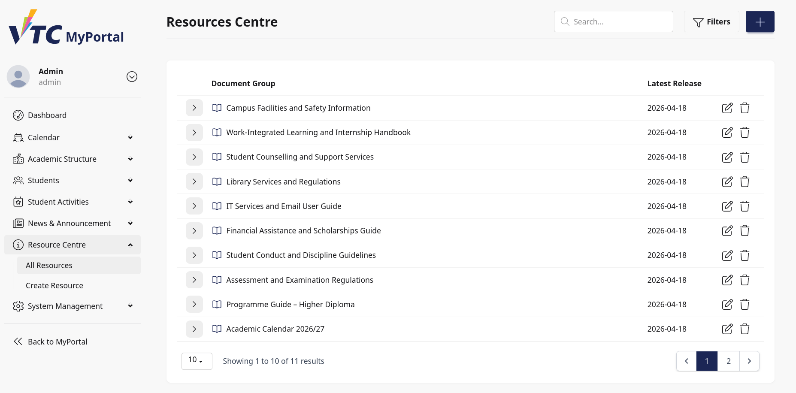
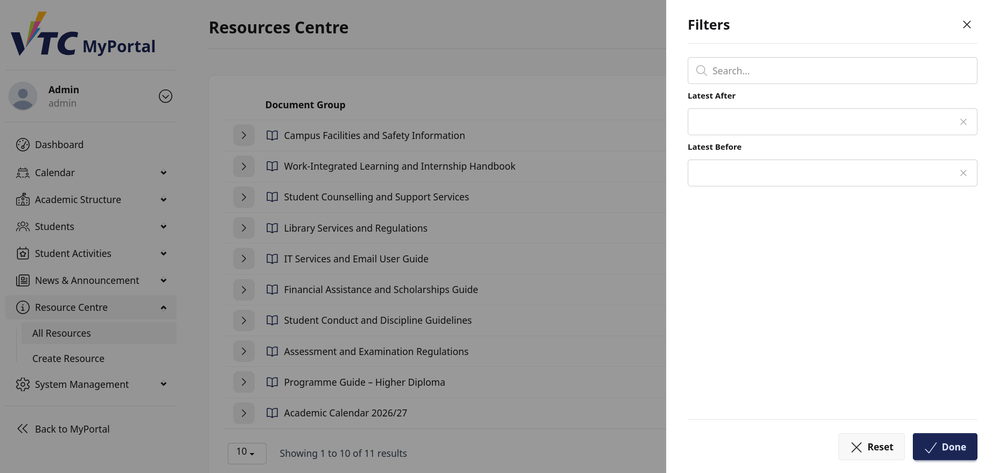
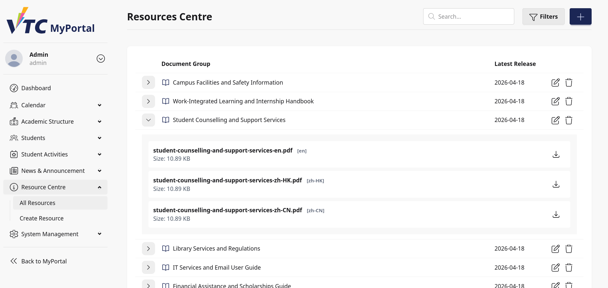
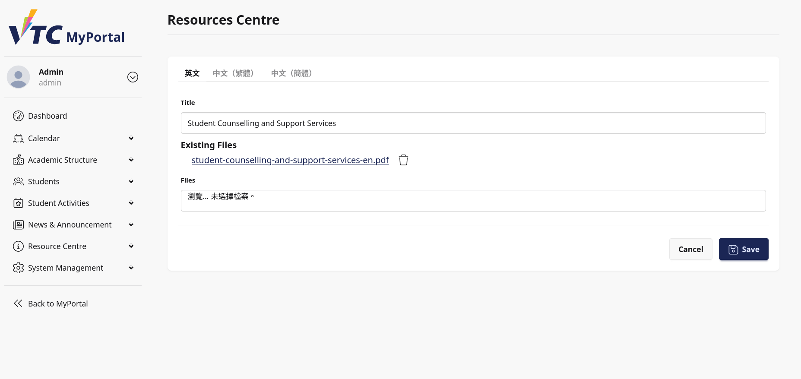
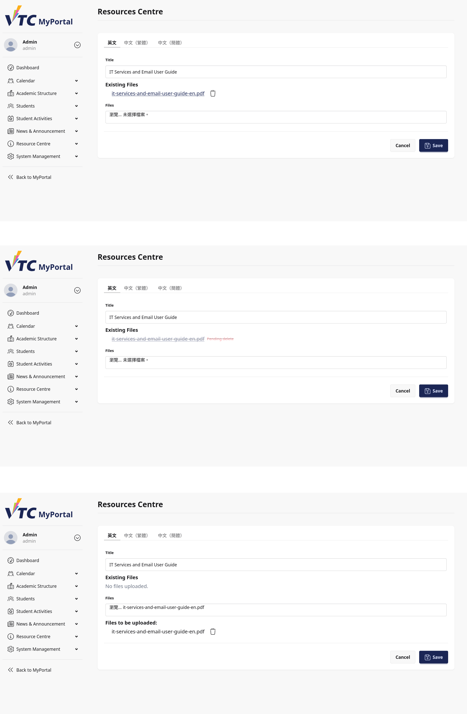

# 15. Dashboard: Resources Centre

## 15.1 Purpose
This chapter explains how staff/admin users manage Resources Centre content in Dashboard.

Pages covered:
1. Resources list page
2. Resource create/edit page

## 15.2 Navigation Overview
From Dashboard navigation, resources management is accessed through:
- All Resources
- Create Resource

Use All Resources for discovery and maintenance. Use Create Resource to add a new document group.

> Image placeholder: Dashboard navigation to Resources Centre management.

## 15.3 Resources List Page
The list page displays resource document groups and latest update date.

Main features:
- Keyword search
- Date range filters (Latest After, Latest Before)
- Expandable rows for attached files
- Row actions (Edit/Delete)
- Pagination controls

Table columns:
- Document Group
- Latest Release

> Image placeholder: Resources list page overview.

## 15.4 Search and Filter
### 15.4.1 Search
Search matches document group titles in current locale translation.

### 15.4.2 Filter Drawer
Filter drawer supports:
- Latest After
- Latest Before

Drawer actions:
- Reset
- Done

Operational note:
- Filtered results are sorted by latest update descending.

> Image placeholder: Resources filter drawer.

## 15.5 Expand Row and Review Files
Each resource row can be expanded to show file-level details.

Expanded row displays:
- File name
- Language tag (locale)
- File size
- Download action

If no files exist, the row shows No files uploaded.

> Image placeholder: Expanded row with multilingual files.

## 15.6 Row Actions: Edit and Delete
Per-row actions:
- Edit: open resource edit page
- Delete: remove resource and related translations/media

Delete behavior:
- System deletes associated media files under translations.
- Success message confirms deletion.

## 15.7 Create/Edit Resource Page
The resource editor supports multilingual titles and file attachments per language.

Page structure:
- Language tabs
- Title field per language
- Existing files block per language
- Pending upload list per language

> Image placeholder: Resource edit page overview.

## 15.8 Multilingual Title Management
For each language tab:
- Enter Title (required)

Validation:
- Title is required under translation rule set.

## 15.9 File Management Workflow
The editor uses deferred file operations before save.

### 15.9.1 Existing Files
For each language tab, existing files are listed with direct links.

Actions on existing file:
- Mark for deletion (pending delete)

Behavior:
- Marked files are not deleted immediately.
- Actual deletion occurs only after Save.

### 15.9.2 Pending Uploads
Upload one or multiple files per language using Files input.

Pending uploads are listed before save.

Actions on pending upload:
- Remove from upload queue

Behavior:
- Files in pending queue are uploaded only after Save.

### 15.9.3 Save Operation
On save:
- Resource and translations are persisted.
- Pending files are uploaded to media collection.
- Pending deletions are executed.
- Pending queues are cleared.

Success outcomes:
- Update mode: Resource was updated.
- Create mode: Resource was created and redirects to edit page.

> Image placeholder: Existing files, pending delete, and pending upload states.

## 15.10 Typical Staff/Admin Workflows
### Workflow A: Create New Document Group
1. Open Create Resource.
2. Enter multilingual titles.
3. Add files in relevant language tabs.
4. Save.
5. Verify record appears on list page.

### Workflow B: Add New Files to Existing Group
1. Open list and find resource.
2. Select Edit.
3. Upload files in target language tab.
4. Save.
5. Verify files appear in expanded list row.

### Workflow C: Retire Outdated Files
1. Open resource in Edit mode.
2. Mark existing files for pending delete.
3. Optionally upload replacement files.
4. Save to apply changes.

### Workflow D: Remove Entire Resource Group
1. Open list page.
2. Select Delete on target row.
3. Confirm row removal and success message.

## 15.11 Troubleshooting
### Case A: Search Returns No Results
- Confirm current locale and title language.
- Clear search and date filters.
- Retry with partial keyword.

### Case B: Files Not Appearing After Upload
- Ensure Save was executed after selecting files.
- Reopen edit page and verify existing files list.

### Case C: File Marked Pending Delete Still Visible
- Pending delete applies only after Save.
- Save the form to finalize deletion.

### Case D: Wrong File Removed
- Review pending delete markers before save.
- If not yet saved, clear pending intent by refreshing workflow and reselecting.

### Case E: Download Link Not Working
- Check network and browser popup settings.
- Retry from expanded row.
- Validate file still exists in edit page existing files section.

## 15.12 Governance and Data Handling Notes
- Maintain consistent titles across locales.
- Keep language-specific files in matching tabs.
- Review pending changes carefully before save.
- Use controlled versioning and remove obsolete files to avoid confusion.

## 15.13 Escalation Information
When reporting Dashboard Resources issues, provide:
- Username and role (staff/admin)
- Page (list or edit)
- Resource title and locale
- Action performed (upload/delete/edit)
- File name(s) involved
- Timestamp, screenshot, browser, and OS details
