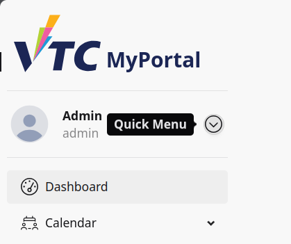
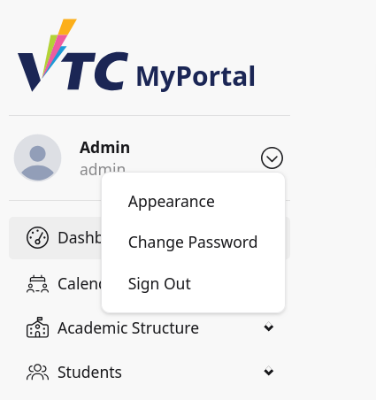
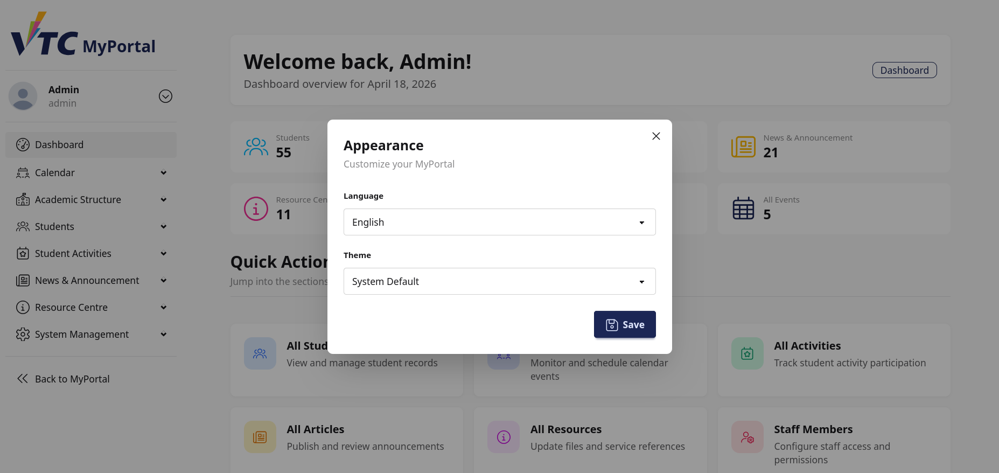

# 17. Appendix: Quick Menu

## 17.1 Purpose
This appendix explains how staff/admin users use the sidebar quick menu in portal and dashboard layouts.

Scope:
1. Open quick menu from user profile row
2. Use Appearance option
3. Navigate to Change Password
4. Sign out securely

## 17.2 Component Behavior Summary
The quick menu appears when an authenticated user is present.

User row shows:
- Given Name
- Username

Quick menu trigger:
- Small circular button with down-chevron icon

Dropdown actions:
- Appearance
- Change Password
- Sign Out

> Image placeholder: Sidebar user row and quick menu trigger for staff/admin.

## 17.3 Open the Quick Menu
1. Open sidebar (or mobile drawer).
2. Locate the user profile row.
3. Select the quick menu icon.
4. Review the dropdown options.

> Image placeholder: Open quick menu dropdown.

## 17.4 Appearance Option
Selecting Appearance toggles the appearance panel component.

Expected result:
- Appearance settings panel opens.
- Visual theme preferences can be adjusted.

How to use:
1. Open quick menu.
2. Select Appearance.
3. Apply desired appearance settings.

> Image placeholder: Appearance panel after quick menu action.

## 17.5 Change Password Option
Selecting Change Password routes the user to password page.

How to use:
1. Open quick menu.
2. Select Change Password.
3. Complete password change process on password screen.

Operational recommendation:
- Rotate staff/admin passwords periodically.
- Use strong passwords with institutional policy compliance.

> Image placeholder: Change password page opened from quick menu.

## 17.6 Sign Out Option
Selecting Sign Out ends the current session.

How to use:
1. Open quick menu.
2. Select Sign Out.
3. Confirm return to unauthenticated/login state.

This is required when using shared office workstations.

> Image placeholder: Sign out action and post-sign-out screen.

## 17.7 Usage Context Across Layouts
The same sidebar-user quick menu component is reused in both:
- Portal layout
- Dashboard layout

Meaning:
- Quick menu behavior is consistent across both contexts.
- Staff/admin users can access these account actions without changing module.

## 17.8 Typical Staff/Admin Workflows
### Workflow A: Adjust UI Before Operations
1. Open quick menu.
2. Select Appearance.
3. Set preferred interface mode.

### Workflow B: Password Hygiene
1. Open quick menu.
2. Select Change Password.
3. Update credentials and continue operations.

### Workflow C: Secure Session End
1. Complete dashboard or portal work.
2. Open quick menu.
3. Select Sign Out.

## 17.9 Troubleshooting
### Case A: Quick Menu Button Missing
- Confirm user is authenticated.
- Ensure sidebar is open.
- Refresh page to reload sidebar component.

### Case B: Appearance Action Has No Visible Effect
- Reopen appearance panel and reapply settings.
- Check if theme preference is overridden by browser/system settings.
- Refresh page to verify applied changes.

### Case C: Change Password Route Fails
- Retry from quick menu.
- Validate route availability and session status.
- Escalate if route consistently fails.

### Case D: Sign Out Does Not End Session
- Retry Sign Out once.
- Refresh login page and verify session termination.
- Escalate if session remains active unexpectedly.

## 17.10 Security and Governance Notes
- Staff/admin accounts should never remain signed in on shared devices.
- Change password immediately after suspected account compromise.
- Report suspicious account behavior to system administrators.

## 17.11 Escalation Information
When reporting quick menu issues, provide:
- Username and role (staff/admin)
- Context (portal or dashboard)
- Quick menu option used
- Expected vs actual result
- Screenshot of sidebar user row and dropdown
