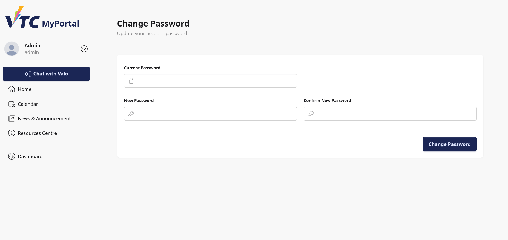

# 18. Appendix: Change Password

## 18.1 Purpose
This appendix explains how staff/admin users update their own account password using the Change Password page.

Scope:
1. Access the page from quick menu
2. Complete required password fields
3. Submit and verify successful update
4. Handle common validation failures

## 18.2 Page Summary
The page is rendered in portal layout and contains:
- Header: Change Password
- Subtitle: Update your account password
- Secure form with three password fields
- Action button: Change Password

Form fields:
- Current Password
- New Password
- Confirm New Password

> Image placeholder: Change Password page in staff/admin context.

## 18.3 Access Path
Typical access route:
1. Open sidebar user quick menu.
2. Select Change Password.
3. Navigate to password page.

This route is shared across portal/dashboard sidebar user component behavior.

## 18.4 Step-by-Step Password Update
1. Enter your current password in Current Password.
2. Enter a new password in New Password.
3. Repeat the same value in Confirm New Password.
4. Select Change Password.

On successful update:
- Current account password is changed.
- Form fields are reset.
- Success message appears: Password has been updated.

> Image placeholder: Password form with all fields completed.

## 18.5 Validation Behavior
The page enforces:
- Current Password must be valid for active session user.
- New Password must satisfy password validation policy.
- Confirm New Password must match New Password.

Validation errors are shown inline near the relevant field.

## 18.6 Security Workflow Recommendations
### Workflow A: Periodic Credential Rotation
1. Open Change Password.
2. Set strong replacement password.
3. Confirm update success.
4. Continue operations.

### Workflow B: Incident Response Password Reset (Self)
1. Immediately open Change Password.
2. Replace password with unique secure value.
3. Sign out and sign in to confirm update.
4. Report security incident if exposure suspected.

## 18.7 Troubleshooting
### Case A: Current Password Validation Error
- Verify exact old password.
- Check keyboard layout and Caps Lock.
- Retry without browser autofill.

### Case B: New Password Policy Failure
- Increase complexity and length.
- Use mixed character categories per policy.
- Avoid reused or weak patterns.

### Case C: Confirmation Does Not Match
- Ensure both new-password fields are identical.
- Re-enter both values carefully.

### Case D: Update Appears Unresponsive
- Wait for submission to finish.
- Refresh and retry once.
- Capture error message details if persists.

## 18.8 Operational and Compliance Notes
- Staff/admin credentials protect elevated access and require stricter hygiene.
- Do not reuse password across external services.
- Never share password in chat, email, or screenshots.
- Sign out on shared or unattended terminals/workstations.

## 18.9 Escalation Information
When reporting password update issues, provide:
- Username and role (staff/admin)
- Approximate time of attempt
- Error message text
- Screenshot of page state (no password exposure)
- Browser and OS details
