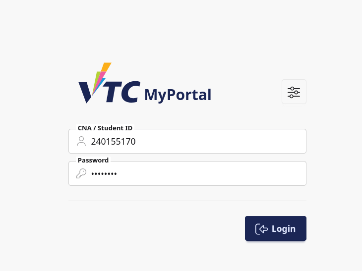
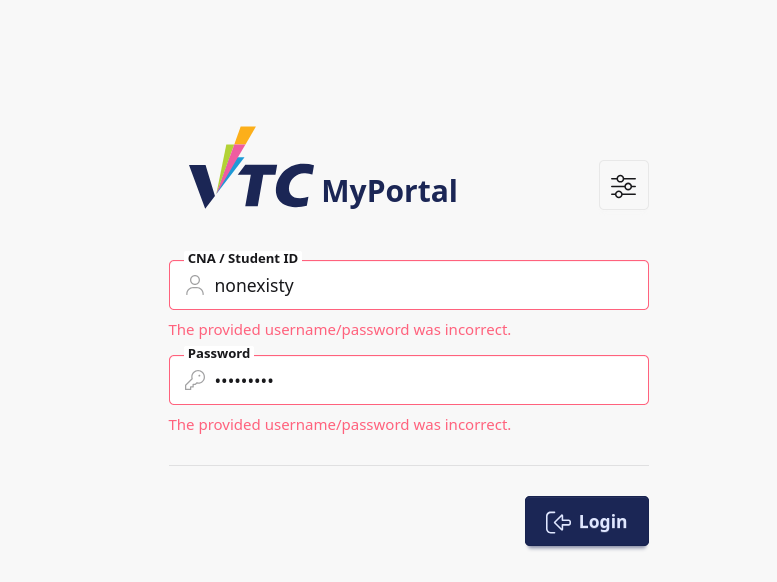

# 1. Login

## 1.1 Purpose
This section explains how student users sign in to VTC MyPortal and access student features.

## 1.2 Who Should Read This
This guide is for:
- Students who are signing in for the first time
- Students who need a refresher on the login process
- Students who are troubleshooting login issues

## 1.3 Before You Start
Prepare the following:
- A valid student username
- The correct password for your account
- A stable internet connection
- A modern web browser (Chrome, Edge, Firefox, or Safari)

## 1.4 Open the Login Page
1. Open your web browser.
2. Go to the VTC MyPortal URL provided by your department.
3. Confirm the login page is displayed with:
   - Username field
   - Password field
   - Login button
   - Appearance (theme) button

## 1.5 Sign In Steps
1. In **Username**, enter your student username.
2. In **Password**, enter your password.
3. Click **Login**.
4. If your credentials are correct, the system signs you in and redirects you to the main page.

## 1.6 Appearance Option (Optional)
The slider icon in the top-right area opens appearance settings.

Use this if you want to adjust the visual theme before or after login.

1. Click the appearance icon.
2. Select your preferred display option.
3. Continue with normal login.

## 1.7 Successful Login Result
After successful login:
- The system creates your authenticated session.
- You are redirected to the main dashboard or intended page.

If you were trying to access a protected page before login, the system may return you to that page automatically.

## 1.8 Login Error Message
If login fails, the same error message is shown for both fields:
- Incorrect username or password

Check the following and try again:
1. Username is typed correctly
2. Password is typed correctly
3. Caps Lock is not enabled
4. No extra spaces were entered

## 1.9 Troubleshooting
### Case A: Cannot Type Password Correctly
- Use the browser password manager carefully.
- Retype the password manually.

### Case B: Repeated Login Failure
- Verify your student account is active.
- Confirm you are using the correct portal URL.
- Contact support if issue persists.

### Case C: Page Does Not Load Properly
- Refresh the page.
- Clear browser cache.
- Try another supported browser.

## 1.10 Security Notes for Students
- Do not share your username or password.
- Always log out after using shared computers.
- Avoid saving passwords on public devices.

## 1.11 Support
If you still cannot sign in, contact your institution support team and provide:
- Your student ID
- Approximate login attempt time
- Screenshot of the error message
- Browser name and version
