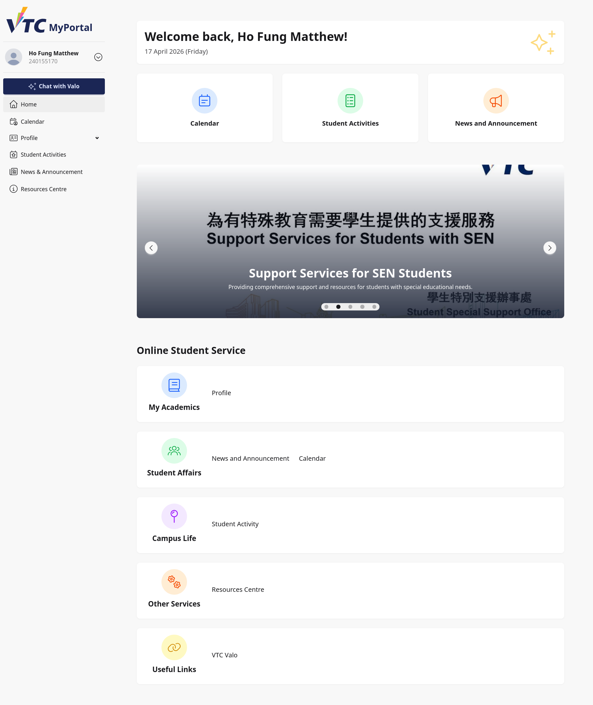
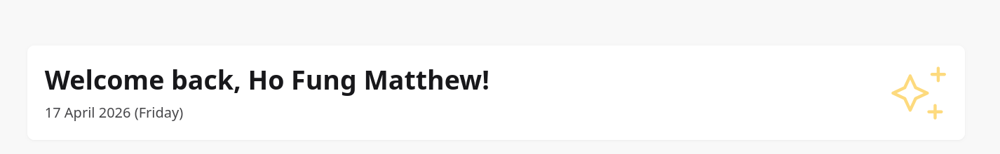
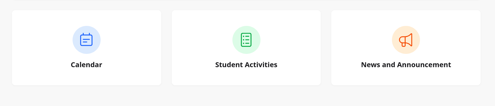
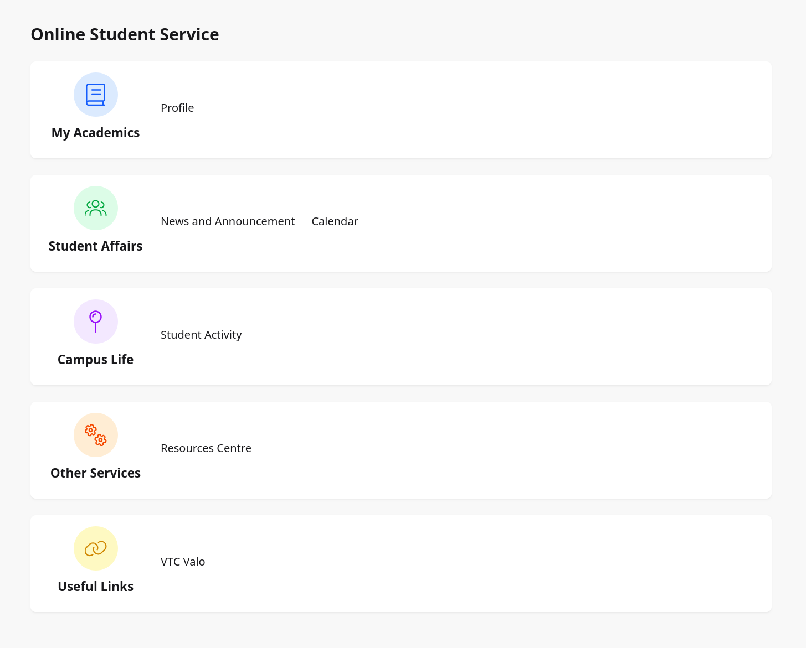

# 2. Home Page

## 2.1 Purpose
This section explains how student users use the Home page after signing in to VTC MyPortal.

The Home page is the main entry point for daily student tasks, including quick access, service links, and announcement banners.

## 2.2 When You Will Use This Page
Students typically use the Home page to:
- Check the welcome panel and current date
- Open Calendar, Student Activities, and News and Announcement
- View carousel slides for latest highlights
- Access Online Student Service categories

## 2.3 Page Overview
After login, the Home page displays the following key areas:
1. Welcome card
2. Quick access cards
3. Carousel banner
4. Online Student Service section

## 2.4 Welcome Card
At the top of the page, the welcome card includes:
- Personalized greeting with your given name
- Current date and day

Use this to confirm you have logged in with the correct account.

> Image placeholder: Welcome card close-up.

## 2.5 Quick Access Cards
Three quick access cards appear below the welcome card.

### 2.5.1 Calendar
Select **Calendar** to open the academic and activity calendar.

### 2.5.2 Student Activities
Select **Student Activities** to browse student activity information.

### 2.5.3 News and Announcement
Select **News and Announcement** to view latest updates.

## 2.6 Carousel Banner
The carousel rotates highlighted slides automatically.

Each slide can contain:
- Banner image
- Title
- Description
- Optional link

How to use:
1. Wait for auto-rotation, or use carousel controls if available.
2. Read title and description.
3. Select the slide link when provided.

> Image placeholder: Carousel section with one active slide.

## 2.7 Online Student Service Section
This section groups links by category.

### 2.7.1 My Academics
- **Profile**: Opens personal particulars.

### 2.7.2 Student Affairs
- **News and Announcement**
- **Calendar**

### 2.7.3 Campus Life
- **Student Activity**

### 2.7.4 Other Services
- **Resources Centre**

### 2.7.5 Useful Links
- **VTC Valo**

## 2.8 Typical Student Tasks
### Task A: View Latest News
1. Go to Home page.
2. Select **News and Announcement** from quick access or Student Affairs.
3. Review published items.

### Task B: Open Personal Profile
1. Go to Home page.
2. Scroll to Online Student Service.
3. Under My Academics, select **Profile**.

### Task C: Check Upcoming Events
1. Go to Home page.
2. Select **Calendar**.
3. Filter and review relevant dates.

## 2.9 Troubleshooting
### Case A: Links Do Not Open
- Refresh the page and retry.
- Confirm internet connection is stable.
- Try another supported browser.

### Case B: Missing Carousel Content
- Refresh browser cache.
- Check again later if content is being updated by administrators.

### Case C: Name or Date Looks Incorrect
- Sign out and sign in again.
- Contact support if account profile data is incorrect.

## 2.10 Good Practices
- Review Home page announcements each time you log in.
- Use service categories instead of bookmarks to avoid outdated URLs.
- Sign out when using shared devices.

## 2.11 Support Information
If you encounter issues, provide:
- Student ID
- Time of issue
- Screenshot of the affected section
- Browser and device details
