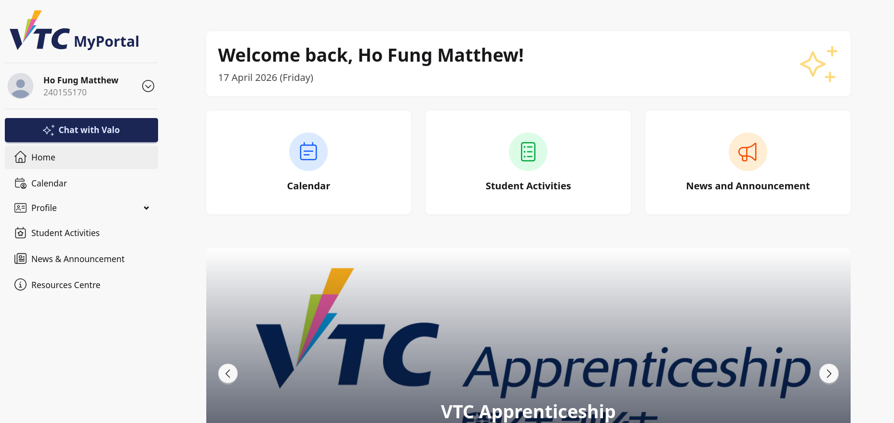
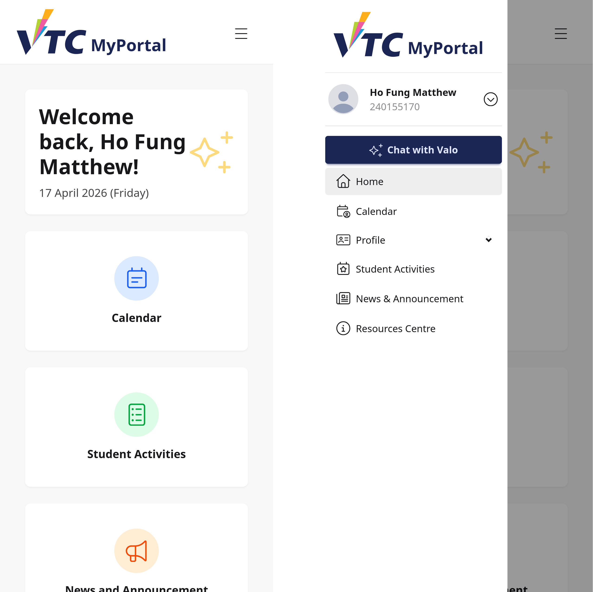
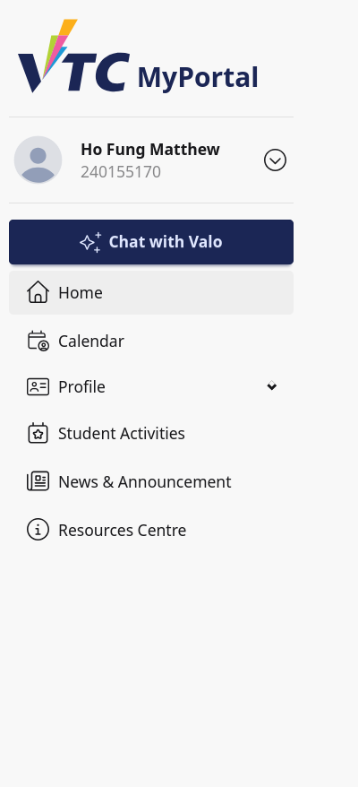
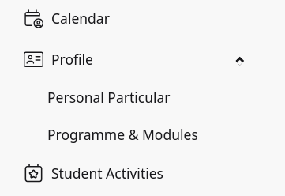

# 3. Portal Navigation

## 3.1 Purpose
This chapter explains how student users navigate the portal layout and access key modules from the side menu.

Scope:
- Mobile top navigation behavior
- Sidebar menu structure
- Student-only menu items
- Shared menu items

## 3.2 Page Layout Overview
The portal layout includes:
1. A mobile top navigation bar
2. A left sidebar menu (drawer on mobile, visible sidebar on desktop)
3. Main content area where each page is displayed

> Image placeholder: Full portal layout showing top bar, sidebar, and content area.

## 3.3 Mobile Top Navigation
On mobile view:
- Brand/logo appears in the top bar.
- A menu icon opens the main drawer.

How to use:
1. Tap the menu icon.
2. Sidebar drawer opens.
3. Select a menu item.
4. Drawer closes after navigation depending on UI behavior.

> Image placeholder: Mobile top bar with drawer icon.

## 3.4 Sidebar Structure for Students
The student sidebar typically contains:
- User profile block
- Chat with Valo button
- Home
- Calendar
- Profile (submenu)
- Student Activities
- News and Announcement
- Resources Centre

The dashboard entry is not shown for student users.

> Image placeholder: Student sidebar menu expanded.

## 3.5 Chat with Valo Quick Access
At the top of the sidebar, a primary button provides quick entry to Chat with Valo.

How to use:
1. Select Chat with Valo.
2. Portal opens the assistant page.

## 3.6 Home and Calendar Navigation
Common student navigation links:
- Home: returns to student portal home.
- Calendar: opens calendar page.

Use these as starting points for daily tasks.

## 3.7 Profile Submenu (Student Only)
Students see a Profile parent menu with two sub-items:
- Personal Particular
- Programme and Modules

How to use:
1. Expand Profile.
2. Select required sub-page.
3. Review or verify your profile details.

> Image placeholder: Profile submenu open state.

## 3.8 Student Activities Link
Students have direct access to Student Activities from the sidebar.

Use this to:
- Browse activity listings
- Open activity details
- Register or cancel participation

## 3.9 News and Resources Links
Shared student links:
- News and Announcement
- Resources Centre

Use these for updates and downloadable resources.

## 3.10 Desktop vs Mobile Behavior
Desktop:
- Sidebar is visible by default.
- Navigation can be done in one click.

Mobile:
- Sidebar is inside a drawer.
- Open/close via top bar menu icon.

## 3.11 Typical Student Navigation Workflows
### Workflow A: Check Today Schedule
1. Open sidebar.
2. Select Calendar.
3. Review events.

### Workflow B: Update Profile Context
1. Open Profile submenu.
2. Select Personal Particular or Programme and Modules.
3. Verify data.

### Workflow C: Open Latest Updates
1. Select News and Announcement.
2. Review latest posts.
3. Return via menu.

### Workflow D: Ask Assistant
1. Select Chat with Valo.
2. Enter question.
3. Continue portal actions via sidebar.

## 3.12 Troubleshooting
### Case A: Menu Not Visible on Mobile
- Tap the top-left/top-right menu icon depending on UI alignment.
- Rotate device or refresh if drawer does not appear.

### Case B: Missing Student Menu Item
- Confirm account is logged in as student.
- Re-login if role/session seems incorrect.

### Case C: Link Opens Wrong Page
- Refresh the page.
- Return to Home and retry menu navigation.

### Case D: Cannot Access Expected Feature
- Verify whether the feature is role-limited.
- Contact support if access should be available.

## 3.13 Good Practices
- Use sidebar navigation instead of old bookmarks.
- Confirm current account from user profile block before sensitive actions.
- On shared devices, sign out when finished.

## 3.14 Support Information
When reporting navigation issues, provide:
- Student ID
- Device type (mobile/desktop)
- Menu item selected
- Expected destination and actual destination
- Screenshot of sidebar/top bar state
