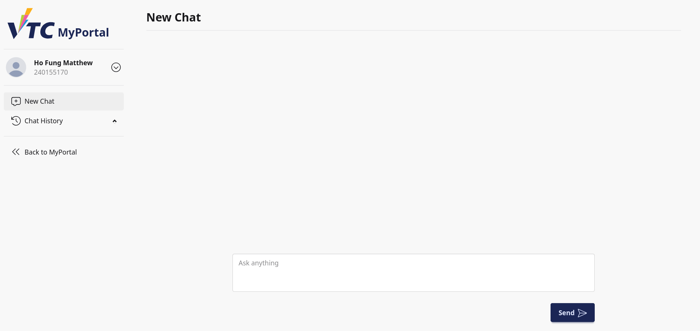
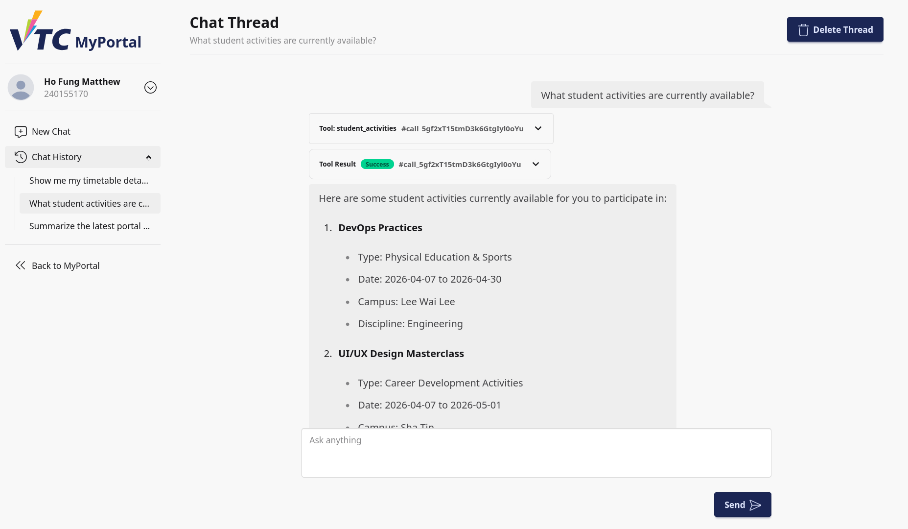
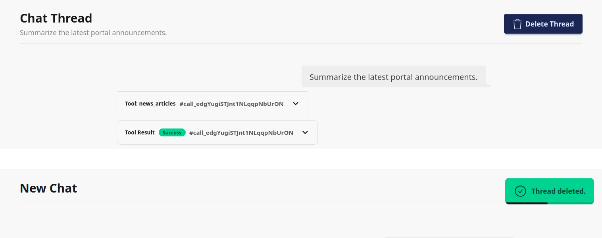

# 4. AI Assistant

## 4.1 Purpose
This section explains how student users interact with the AI Assistant page in VTC MyPortal.

The AI Assistant supports question answering and can help with general portal-related information, student profile context, timetable context, and selected student service information.

## 4.2 Audience
This guide is for:
- Students starting a new conversation with the assistant
- Students reviewing previous conversations
- Students managing chat history

## 4.3 Before You Start
Prepare the following:
- Signed-in student account
- Stable internet connection
- A clear question to ask in natural language

## 4.4 Page Layout Overview
The Assistant page has two main areas:
1. Left sidebar (navigation and chat history)
2. Main chat area (messages and input box)

### 4.4.1 Sidebar Elements
- Brand logo area
- **New Chat**
- **Chat History** (previous threads)
- **Back to Portal**

### 4.4.2 Main Area Elements
- Header: **New Chat** or **Chat Thread**
- Message list area
- Input area with text box and **Send** button
- **Delete Thread** button (shown only when viewing an existing thread)

> Image placeholder: Full assistant page with sidebar and chat area labels.

## 4.5 Start a New Chat
1. Open the Assistant page from portal navigation.
2. Confirm the header shows **New Chat**.
3. In the input box, type your question.
4. Select **Send**.
5. Wait for the assistant response to complete.

After the first message is sent:
- A new chat thread is created automatically.
- The thread appears under **Chat History**.

> Image placeholder: New chat state before sending first message.

## 4.6 Continue an Existing Chat Thread
1. In the sidebar, open **Chat History**.
2. Select a previous thread.
3. Review earlier messages.
4. Enter a follow-up question and select **Send**.

The message list auto-scrolls to keep recent messages visible while the assistant replies.

> Image placeholder: Existing chat thread with historical messages.

## 4.7 Ask Effective Questions
Use clear and specific prompts for better results.

Recommended pattern:
1. State your goal
2. Provide context (course, date, topic)
3. Ask one focused question

Examples:
- "Show me my timetable details for this week."
- "What student activities are currently available?"
- "Summarize the latest portal announcements."

## 4.8 Response Behavior
When you send a question:
- Your message is added to the conversation.
- The assistant generates and streams its response progressively.
- Tool-based information may be used depending on your question.

If a response takes longer than expected, wait until the stream completes before sending another question.

## 4.9 Delete a Chat Thread
Use this only when you want to permanently remove the current conversation.

1. Open the thread you want to remove.
2. Select **Delete Thread**.
3. The system removes the thread and returns to the assistant entry page.

> Image placeholder: Delete Thread button and post-delete state.

## 4.10 Return to Portal
To leave the Assistant page:
1. In the sidebar, select **Back to Portal**.
2. You are redirected to the portal home page.

## 4.11 Troubleshooting
### Case A: Assistant Page Unavailable
- If service is temporarily unavailable, retry later.
- Refresh browser and reopen Assistant page.

### Case B: Message Not Sent
- Confirm the input is not empty.
- Re-enter your question and select **Send** again.
- Check internet connection.

### Case C: No Response or Slow Response
- Wait for streaming to complete.
- Avoid sending multiple duplicate messages quickly.
- Refresh and reopen the same thread if needed.

### Case D: Thread Missing in Chat History
- Trigger a refresh by reopening Assistant page.
- Confirm message was sent successfully in the current session.

## 4.12 Privacy and Safe Use Notes
- Do not include passwords or highly sensitive personal data in prompts.
- Ask only portal-related or study-related questions where possible.
- Verify important decisions against official sources (announcements, instructors, support staff).

## 4.13 Support Information
When requesting support, provide:
- Student ID or username
- Approximate time of issue
- Thread name (if available)
- Screenshot of the issue
- Browser and device information
