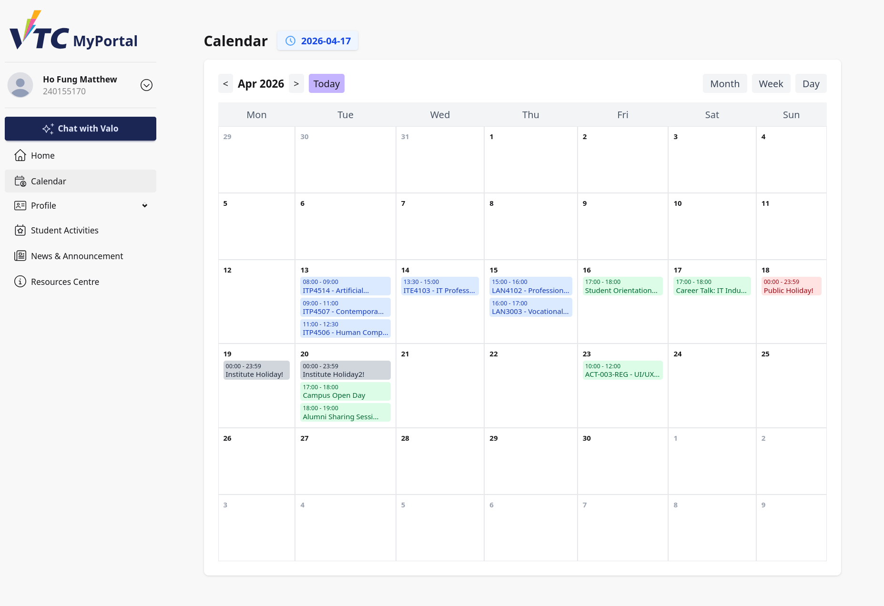
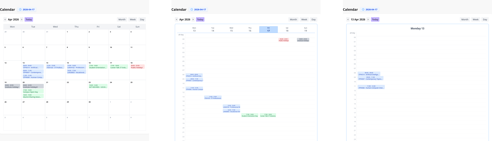
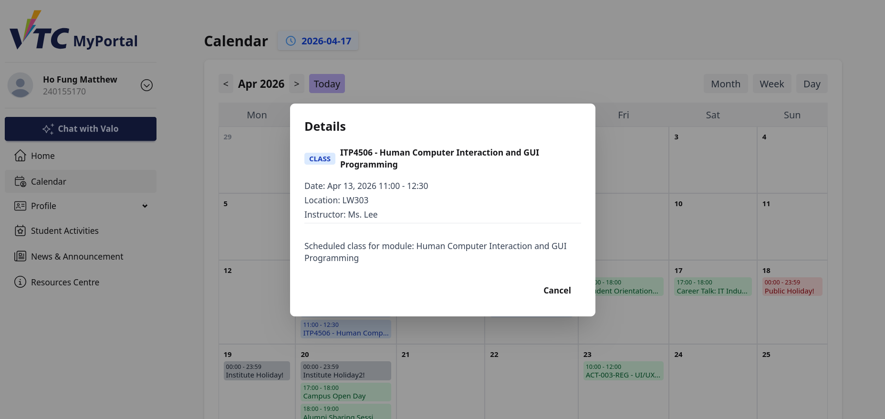

# 5. Calendar

## 5.1 Purpose
This section explains how students use the Calendar page in VTC MyPortal.

The Calendar helps students view class timetable items, personal activity items, and holiday events in Month, Week, and Day formats.

## 5.2 What Students Can See
For student users, the Calendar may include:
- Class timetable events linked to your enrolled classes
- Activity events assigned to your student account
- Public holidays
- Institute holidays for your own institute (or institute-wide entries)

## 5.3 Access the Calendar Page
You can open Calendar from:
1. Home page quick access card: **Calendar**
2. Home page service links under **Student Affairs**

> Image placeholder: Entry points to Calendar from Home page.

## 5.4 Page Layout Overview
Top section:
- Page title: **Calendar**
- Current date indicator (YYYY-MM-DD)

Control section:
- Left and right navigation arrows
- Period label (changes by view)
- **Today** button
- View switch buttons: **Month**, **Week**, **Day**

Main section:
- Calendar grid based on selected view
- Event chips/buttons by date and time

> Image placeholder: Calendar page with labeled controls.

## 5.5 Use the View Modes
### 5.5.1 Month View
Month view displays:
- A 7-column calendar (Mon to Sun)
- Daily event entries in each date cell
- Truncated event labels for compact display

How to use:
1. Select **Month**.
2. Use `<` and `>` arrows to move between months.
3. Select any event entry to open details.

### 5.5.2 Week View
Week view displays:
- 7-day week columns (Mon to Sun)
- All-day row at the top
- Hourly rows from 00 to 23

How to use:
1. Select **Week**.
2. Use `<` and `>` arrows to change week.
3. Review all-day and hourly events.
4. Select an event to open details.

### 5.5.3 Day View
Day view displays:
- Single day header
- All-day row
- Hourly timeline from 00 to 23

How to use:
1. Select **Day**.
2. Use `<` and `>` arrows to move day by day.
3. Select an event item to view details.

> Image placeholder: Month, Week, and Day view comparison.

## 5.6 Navigate Quickly with Today Button
At any time:
1. Select **Today**.
2. Calendar resets to current date context.
3. Current month/week/day is shown automatically.

## 5.7 Understand Event Colors and Types
Event badges/chips are color-coded by type:
- Class
- Activity
- Public holiday
- Institute holiday

This helps you identify event categories quickly in dense schedules.

> Image placeholder: Event color legend sample.

## 5.8 Open Event Details Modal
Select any event item from Month/Week/Day view to open the detail modal.

The detail window may show:
- Event type
- Event title
- Date and time (or whole-day status)
- Location (if available)
- Instructor (if available)
- Description (if available)

To close details:
1. Select **Cancel**.

> Image placeholder: Event details modal with fields.

## 5.9 Typical Student Tasks
### Task A: Check This Week's Class Schedule
1. Open Calendar.
2. Select **Week** view.
3. Review class entries by hour.
4. Select an item for full details.

### Task B: Check Holiday Information
1. Open Calendar.
2. Use **Month** view for broad overview.
3. Identify holiday entries by event type color.
4. Open details for exact date and notes.

### Task C: Verify Activity Time and Location
1. Open Calendar.
2. Locate activity event in Week or Day view.
3. Select event entry.
4. Read location and description in modal.

## 5.10 Troubleshooting
### Case A: No Events Displayed
- Confirm you are in the correct date range.
- Select **Today** to reset position.
- Verify your account has class/activity records.

### Case B: Event Text Is Truncated
- Select the event to open full details in modal.

### Case C: Incorrect Date Context
- Use **Today** button.
- Switch between Month/Week/Day to confirm timeline.

### Case D: Event Detail Modal Not Opening
- Retry with another event.
- Refresh the page and try again.
- Use a supported browser if issue persists.

## 5.11 Good Practices
- Use Month view for planning, Week view for schedule checks, Day view for detailed timing.
- Open event details whenever location/instructor is needed.
- Recheck calendar periodically for updated activities and holiday notices.

## 5.12 Support
When reporting calendar issues, provide:
- Student ID
- View mode used (Month/Week/Day)
- Date range where issue occurred
- Screenshot of the event area
- Browser and device information
