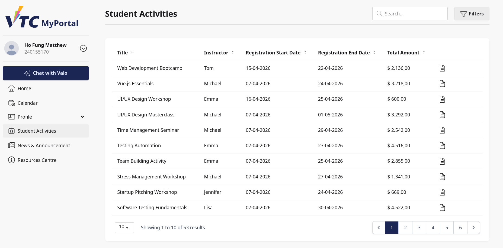
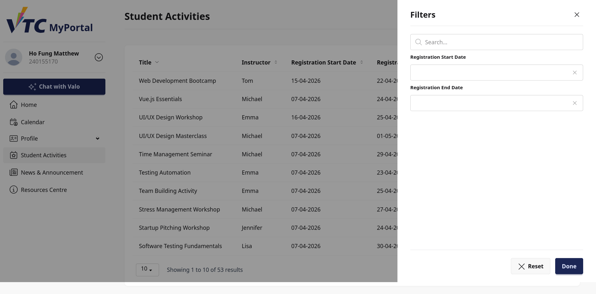
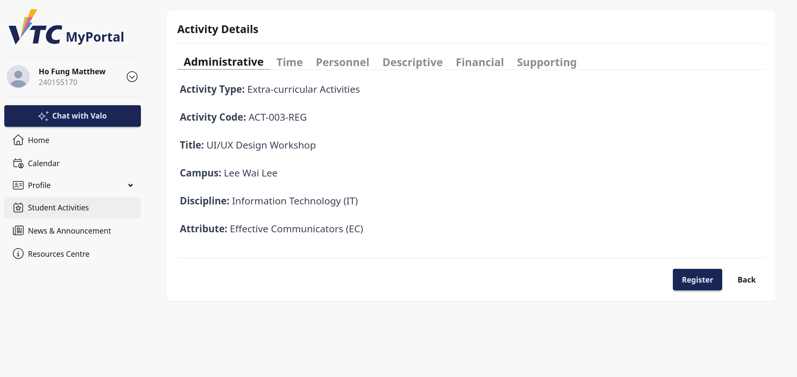
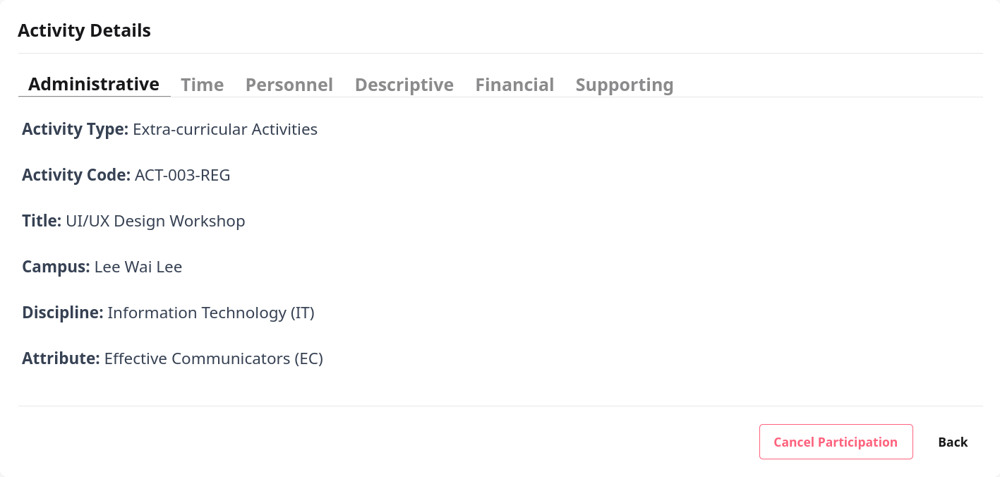
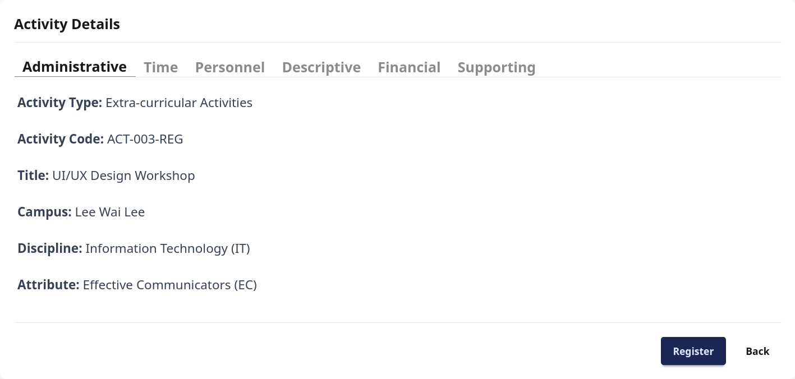

# 7. Student Activities

## 7.1 Purpose
This chapter explains how student users browse activity listings, view activity details, register participation, and cancel participation in VTC MyPortal.

Pages covered in this chapter:
1. Activity List
2. Activity Details
3. Register Processing Page
4. Unregister Processing Page

## 7.2 Access Student Activities
You can open Student Activities from:
- Home page quick access card: Student Activities
- Home page service links under Campus Life

> Image placeholder: Student Activities entry point from Home page.

## 7.3 Activity List Page
The Activity List page shows published student activities in a paginated table.

Main elements:
- Page title: Student Activities
- Search box (keywords)
- Filters drawer
- Activity table with sorting and pagination
- Details action per activity row

Table columns include:
- Title
- Instructor
- Registration Start Date
- Registration End Date
- Total Amount

> Image placeholder: Activity list full-page overview.

## 7.4 Search and Filter Activities
### 7.4.1 Keyword Search
Use the search input to find activities by title or description.

How to use:
1. Enter keywords in Search.
2. Wait for results refresh.
3. Review filtered list.

### 7.4.2 Filter Drawer
Select Filters to open the filter drawer.

Available filters:
- Search keywords
- Registration Start Date
- Registration End Date

Actions:
- Reset: clears all filter fields
- Done: closes drawer

> Image placeholder: Filters drawer with date controls.

## 7.5 Sort and Browse Results
Table supports sorting on key fields such as title, instructor, registration dates, and total amount.

Pagination options include 5, 10, and 20 rows per page.

Recommended workflow:
1. Apply date and keyword filters.
2. Sort by Registration Start Date or End Date.
3. Open Details for a target activity.

## 7.6 Open Activity Details
From the list, select Details on a row to open the Activity Details page.

The details page is organized into tabs:
1. Administrative
2. Time
3. Personnel
4. Descriptive
5. Financial
6. Supporting

> Image placeholder: Activity Details page with tab layout.

## 7.7 Activity Details Tabs
### 7.7.1 Administrative Tab
Typical fields:
- Activity Type
- Activity Code
- Title
- Campus
- Discipline
- Attribute

### 7.7.2 Time Tab
Typical fields:
- Registration Period (From/To)
- Time Slot (date/time range)
- Duration (hours)

### 7.7.3 Personnel Tab
Typical fields:
- Instructor
- Responsible Staff

### 7.7.4 Descriptive Tab
Typical fields:
- Description
- Venue
- Venue Remark

### 7.7.5 Financial Tab
Typical fields:
- Total Amount
- Included Deposit

### 7.7.6 Supporting Tab
Typical fields:
- Attachment (if available)
- File size
- Download action
- SWPD Programme flag (Yes/No)

If no file is attached or file is missing, the page shows corresponding status text.

## 7.8 Registration Status and Action Buttons
On the Activity Details page, action buttons depend on your current status and activity conditions.

Possible states:
- Register: registration is open and vacancy is available
- Full: activity capacity is reached
- Registration period has ended
- Cancel Participation: you are already registered

For student users, the primary action is Register or Cancel Participation depending on status.

## 7.9 Register for an Activity
When Register is selected:
1. System opens a processing page.
2. Registration is performed automatically.
3. On success, system redirects back to Activity Details.

Expected outcomes on success:
- Participation record is created
- Activity event is added to your personal calendar
- Success notification is shown

> Image placeholder: Register processing screen and success return state.

## 7.10 Cancel Participation (Unregister)
When Cancel Participation is selected:
1. System opens a processing page.
2. Cancellation is performed automatically.
3. On success, system redirects back to Activity Details.

Expected outcomes on success:
- Participation record is removed
- Related activity event is removed from your calendar
- Success notification is shown

> Image placeholder: Unregister processing screen and success return state.

## 7.11 Calendar Integration Note
Registering an activity adds an Activity-type calendar entry with date/time and venue context.

Cancelling participation removes the related calendar event.

After registration changes, open Calendar to verify schedule updates.

## 7.12 Typical Student Workflows
### Workflow A: Find and Join an Activity
1. Open Student Activities list.
2. Search/filter by period and keyword.
3. Open Details.
4. Review tabs and supporting file.
5. Select Register.
6. Confirm redirected details page and updated button state.

### Workflow B: Cancel Existing Participation
1. Open Activity Details for a registered activity.
2. Select Cancel Participation.
3. Wait for processing and redirect.
4. Verify registration status is removed.

### Workflow C: Compare Multiple Activities
1. Use filters for registration date range.
2. Sort by title, instructor, or amount.
3. Open details pages in sequence.
4. Decide based on time slot, venue, and financial info.

## 7.13 Troubleshooting
### Case A: Cannot Register
Possible causes:
- Registration period closed
- Activity is full
- Student profile is incomplete or missing

Actions:
1. Check status message on details page.
2. Confirm registration period and capacity.
3. Contact support if profile linkage appears incorrect.

### Case B: Register/Cancel Seems Stuck
- Wait for processing spinner to complete.
- Refresh page and reopen activity details.
- Check whether button state changed after refresh.

### Case C: Calendar Not Updated Immediately
- Refresh Calendar page.
- Confirm you are viewing correct date range.
- Recheck activity time slot in details tab.

### Case D: Attachment Cannot Download
- Check network connection.
- Retry file download.
- If file missing message appears, contact support.

## 7.14 Good Practices
- Review Time and Descriptive tabs before registering.
- Verify registration window and any cost/deposit details.
- Recheck calendar after registration or cancellation.
- Keep screenshots of errors when reporting issues.

## 7.15 Support Information
When reporting Student Activities issues, provide:
- Student ID
- Activity name/code
- Action attempted (register or cancel)
- Timestamp of attempt
- Screenshot of list/details/processing page
- Browser and device information
