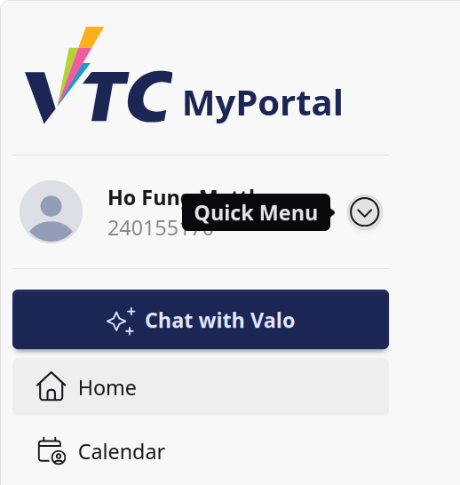
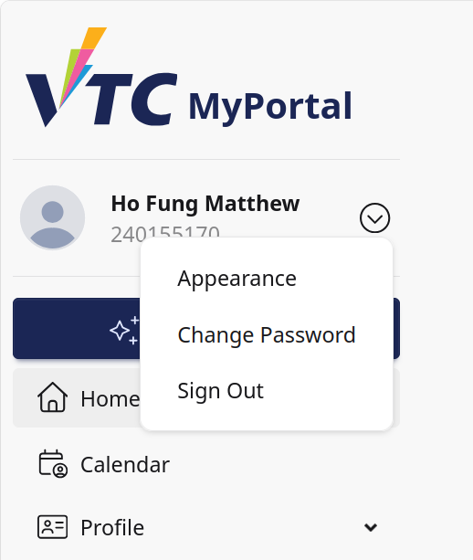
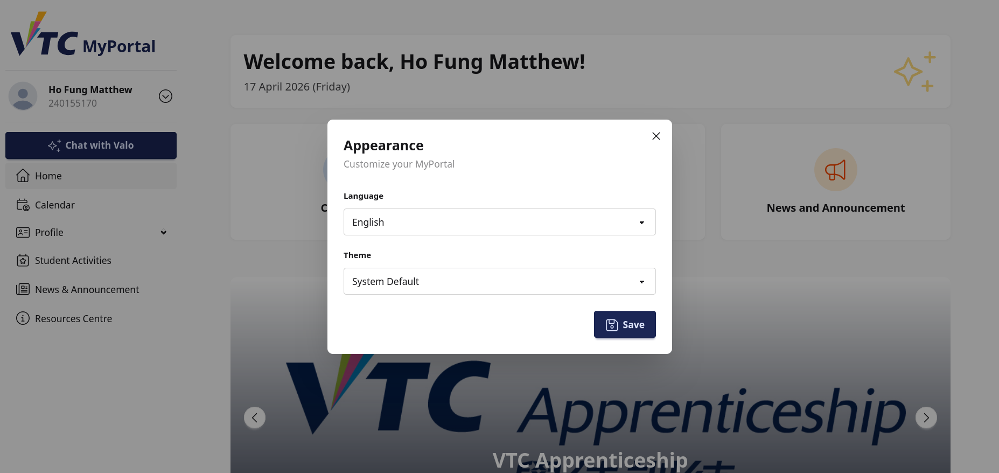

# 10. Appendix: Quick Menu

## 10.1 Purpose
This appendix explains how student users use the sidebar quick menu shown in the user profile block.

Scope:
1. Open quick menu from sidebar user card
2. Change appearance settings
3. Open change password page
4. Sign out safely

## 10.2 Where the Quick Menu Appears
The quick menu is available in the sidebar user component when a user is authenticated.

Visible profile information in the user row:
- Display name (Given Name)
- Username

Quick menu trigger:
- Circular dropdown button with down-chevron icon

## 10.3 Open the Quick Menu
1. Open the sidebar (or drawer on mobile).
2. Locate your user card near the top of the menu.
3. Select the quick menu button.
4. A dropdown menu opens with available actions.

Menu options:
- Appearance
- Change Password
- Sign Out

## 10.4 Appearance Option
Selecting Appearance toggles the appearance panel.

Expected behavior:
- Appearance modal/panel opens.
- You can adjust visual preferences.
- Updated appearance is applied in the UI.

How to use:
1. Open quick menu.
2. Select Appearance.
3. Choose preferred appearance settings.
4. Close panel when done.

## 10.5 Change Password Option
Selecting Change Password navigates to the password route.

How to use:
1. Open quick menu.
2. Select Change Password.
3. Complete the password update form on the password page.
4. Save changes.

Recommended practice:
- Use strong password format and do not reuse old credentials.

## 10.6 Sign Out Option
Selecting Sign Out logs the user out.

How to use:
1. Open quick menu.
2. Select Sign Out.
3. Confirm you are redirected to logged-out state/login page.

Use this every time on shared devices.

## 10.7 Mobile and Desktop Notes
Desktop:
- Sidebar is usually always visible.
- Quick menu can be opened immediately.

Mobile:
- Open drawer first via top navigation menu icon.
- Then open quick menu from user row.

## 10.8 Typical Student Workflows
### Workflow A: Change Theme Quickly
1. Open sidebar quick menu.
2. Select Appearance.
3. Apply preferred display settings.

### Workflow B: Update Password
1. Open quick menu.
2. Select Change Password.
3. Submit new password and return to portal.

### Workflow C: Secure Logout
1. Open quick menu.
2. Select Sign Out.
3. Close browser on shared/public computer.

## 10.9 Troubleshooting
### Case A: Quick Menu Not Visible
- Confirm you are signed in.
- Open sidebar/drawer if hidden.
- Refresh page if user block did not render correctly.

### Case B: Appearance Panel Does Not Open
- Reclick Appearance option.
- Check if popup/panel is blocked by overlay.
- Refresh and retry.

### Case C: Change Password Link Not Working
- Retry from quick menu.
- Navigate to password page manually if needed.
- Report route issue if persistent.

### Case D: Sign Out Not Completing
- Retry Sign Out.
- Clear stale session by refreshing login page.
- Report if session remains unexpectedly authenticated.

## 10.10 Security Notes
- Never share your account credentials.
- Always sign out on shared devices.
- Change password immediately if you suspect account exposure.

## 10.11 Support Information
When reporting quick menu issues, provide:
- Student ID/username
- Device type (mobile or desktop)
- Which quick menu option failed
- Expected and actual behavior
- Screenshot of sidebar user area and dropdown
