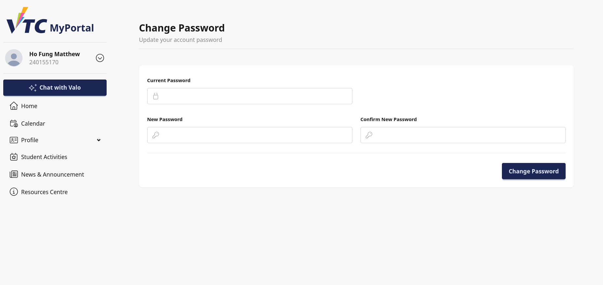
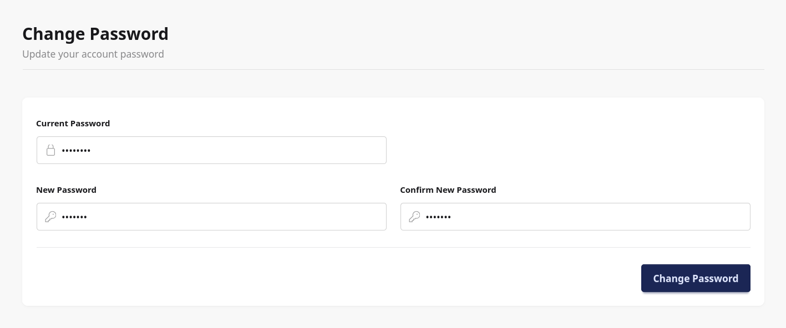

# 11. Appendix: Change Password

## 11.1 Purpose
This appendix explains how student users change their own account password from the Change Password page.

Scope:
1. Open Change Password page
2. Enter required password fields correctly
3. Submit update and confirm success
4. Resolve common validation errors

## 11.2 Page Overview
The Change Password page includes:
- Header title: Change Password
- Subtitle: Update your account password
- A form with three fields
- A primary action button: Change Password

Form fields:
- Current Password
- New Password
- Confirm New Password

## 11.3 How to Access This Page
Common access path:
1. Open sidebar quick menu.
2. Select Change Password.
3. System opens the Change Password page.

## 11.4 Password Change Steps
1. In Current Password, enter your existing password.
2. In New Password, enter your new password.
3. In Confirm New Password, re-enter the same new password.
4. Select Change Password.

Expected success behavior:
- Password is updated for the currently signed-in account.
- Input fields are cleared.
- Success message is shown: Password has been updated.

## 11.5 Validation and Security Rules
The page enforces:
- Current Password must match your actual current account password.
- New Password must satisfy system password policy.
- Confirm New Password must match New Password.

If validation fails, field-level error messages are shown.

## 11.6 Typical Student Workflow
### Workflow A: Routine Password Update
1. Open Change Password page.
2. Enter current password.
3. Set a strong new password.
4. Confirm and submit.
5. Continue using the portal.

### Workflow B: Suspected Password Exposure
1. Open Change Password immediately.
2. Set a new unique password.
3. Sign out and sign in again to verify new credential works.

## 11.7 Troubleshooting
### Case A: Current Password Rejected
- Re-enter current password carefully.
- Check Caps Lock and keyboard language.
- Retry using manual typing (not autofill).

### Case B: New Password Rejected
- Ensure password meets complexity requirements.
- Avoid weak/common patterns.
- Retry with longer and stronger combination.

### Case C: Confirmation Mismatch
- Confirm New Password must be exactly identical to New Password.
- Re-enter both fields and submit again.

### Case D: Submit Button Spins but No Success
- Wait for request completion.
- Refresh page and retry once.
- If issue persists, report with screenshot.

## 11.8 Good Practices
- Use unique password not shared with other services.
- Update password periodically.
- Do not store passwords in unsecured notes.
- Sign out from shared/public devices after change.

## 11.9 Support Information
When reporting password change issues, provide:
- Student ID/username
- Time of attempt
- Error message shown
- Screenshot of form state (without exposing passwords)
- Browser and device details
